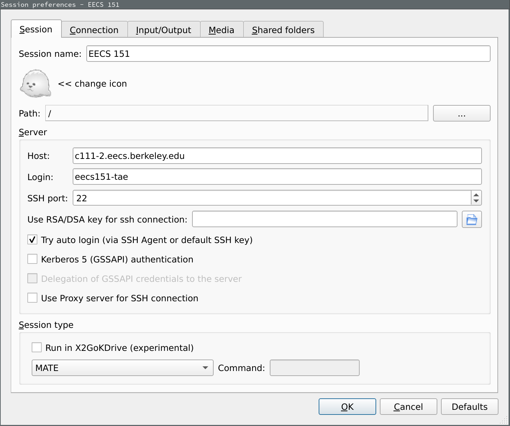
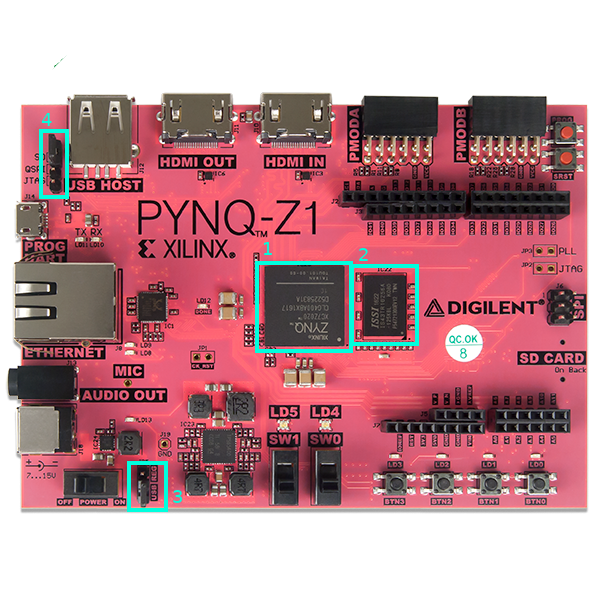
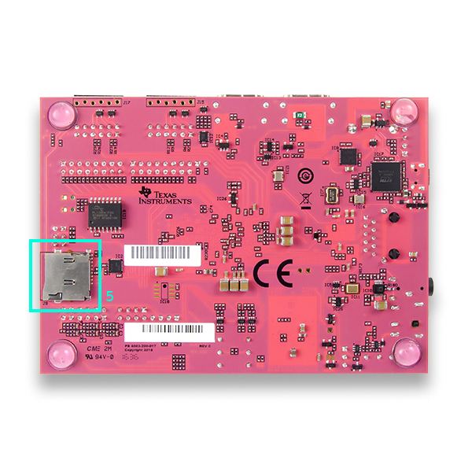
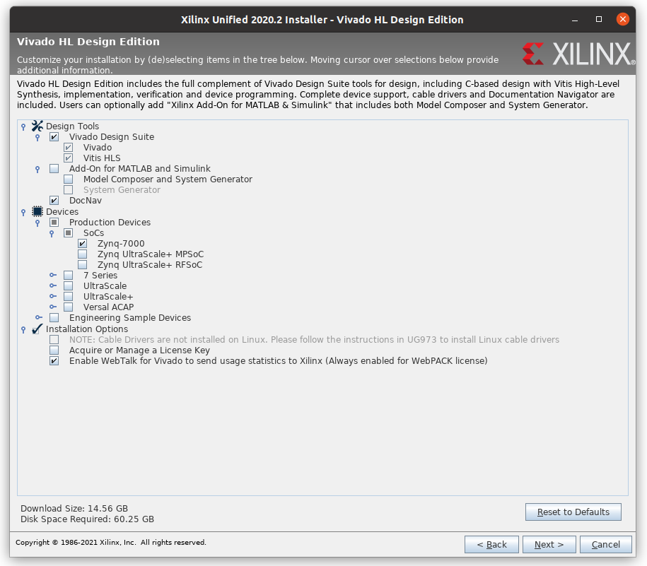

# FPGA Lab 1: Getting Set Up - Accounts, FPGA Board, Vivado, Basic Verilog
<p align="center">
Prof. Sophia Shao
</p>
<p align="center">
TAs: Alisha Menon, Yikuan Chen
</p>
<p align="center">
Department of Electrical Engineering and Computer Science
</p>
<p align="center">
College of Engineering, University of California, Berkeley
</p>

## Setting Up Accounts

### Where to Get Info
- The [course webpage](https://inst.eecs.berkeley.edu/~eecs151/sp22/) for lecture slides, links to labs, homework postings, and times for labs/discussions/OH
- [Gradescope](https://www.gradescope.com/courses/351556) for submitting homework
- [Piazza](https://piazza.com/berkeley/spring2022/eecs151251a/home) for announcements and a discussion forum for homeworks / labs
    - You should register a Piazza account and enroll in the class page as soon as possible

### Getting an EECS 151 Account
All students enrolled in the FPGA lab are required to get a EECS 151 class account to login to the workstations in lab.
Get a class account by using [this webapp](https://inst.eecs.berkeley.edu/webacct).

Login using your CalNet ID, click on 'Get a new account' in the eecs151 row.
Once the account has been created, you should email your class account form to yourself to have a record of your account information.

### Log In To a Workstation
#### In the Lab
Log in to a workstation in the lab, using your `eecs151-xxx` login and initial password.

#### Remotely (from your laptop)
The workstations used for this class are `c111-1.eecs.berkeley.edu` - `c111-17.eecs.berkeley.edu`, and are physically located in Cory 111/117.
Other servers such as `eda-1.eecs.berkeley.edu` through `eda-12.eecs.berkeley.edu` can be used for development too.
You can access all of these machines remotely through SSH.

Not all lab workstations will necessarily be available at a given time, so try a different one if you're having trouble connecting.

Log in to a lab machine by SSHing with your class account `eecs151-xxx`.
```shell
ssh eecs151-xxx@c111-2.eecs.berkeley.edu
```
##### SSH from off-campus network
You need to connect via a Berkeley VPN before you can access the lab machines via ssh.
Please visit: https://security.berkeley.edu/services/bsecure/bsecure-remote-access-vpn and scroll down to "How to Get Started" section if you haven't configured the Berkeley VPN before.

If you are still unable to ssh, try setting the VPN Gateway to "Library Access and Full Tunnel".


### Changing Your EECS151 Account Password
Run `ssh update.cs.berkeley.edu` once you have logged in physically or remotely on your `eecs151-xxx` account.
Follow the prompts to set up a new password.

You can always use the [same webapp](https://inst.eecs.berkeley.edu/webacct) that you used to create your account to reset your password if you forget it.

### Getting a Github Account
If you haven't done so before, sign up for a [Github account](https://github.com/signup) with your `berkeley.edu` email address.

If you already have a Github account that's registered with your personal email address, don't create a new account.
Instead, log in to Github, [go here](https://github.com/settings/emails), and add your `berkeley.edu` email address to your Github account.

### SSH Keys
We will use SSH keys to authenticate with Github.
Run these commands when logged in on your `eecs151-xxx` account.

- Create a new SSH key:
```shell
ssh-keygen -t ed25519 -C "your_email@example.com"
```
Keep hitting enter to use the default settings.

- Copy your public key:
```
cat ~/.ssh/id_ed25519.pub
```
Copy the text that's printed out.

- Add the key to your Github account. [Go here](https://github.com/settings/keys), click on "New SSH Key", paste your public key, and click "Add SSH key".

- Finally test your SSH connection
```shell
ssh -T git@github.com
Hi <username>! You've successfully authenticated, but GitHub does not provide shell access.
```

If you want to work on the labs directly from your laptop instead of via a workstation, you should repeat this process on your laptop (using WSL on Windows and the terminal on OSX or Linux).

### Some Notes for Remote Login
If you're using the lab machines from your laptop, here are a few more things to do.

#### Use SSH Keys to Log In Without a Password
Use the same instructions from above to generate a public/private key pair on your laptop.
Run this from your laptop to copy your public key to the lab machine.
```shell
ssh-copy-id eecs151-xxx@c111-2.eecs.berkeley.edu
```

Now you should be able to ssh to the lab machine without providing a password.
```shell
ssh eecs151-xxx@c111-2.eecs.berkeley.edu
```

#### Use X2go for a Remote Desktop
To run software on the lab machine that requires a graphical user interface (e.g. firefox, vivado GUI), you should use `x2go`.
[Install it from here](https://wiki.x2go.org/doku.php) (or install the `x2goclient` package if you're using Linux).

Open `x2go`, create new session with the following settings (use your `eecs151-xxx` class account in the "Login" field)

<p align="center">

</p>

Click the session on the right bar to start it, and you should see a CentOS Linux desktop environment.
This desktop is running on the lab machine of your choice and is being forwarded to you by `x2go`.

#### (For best compatibility, please use X2go rather than NoMachine to remotely log in)

## Getting Familiar with our Development Environment

### Linux Basics
We will be using a Linux development environment.
If you are unfamiliar or uncomfortable with Linux, and in particular, using the bash shell, you should definitely check out [this tutorial](https://www.digitalocean.com/community/tutorial_series/getting-started-with-linux).

It is highly recommended to go through all four parts of the tutorial above.
To complete the labs and projects for this course, you will need good command line skills.

One of the best ways to expand your working knowledge of bash is to watch others who are more experienced. Pay attention when you are watching someone else's screen and ask questions when you see something you don't understand. You will quickly learn many new commands and shortcuts.

### Git Basics
Feel free to skip this section if you already have some prior experience with using git.

Version control systems help track how files change over time and make it easier for collaborators to work on the same files and share their changes.
For projects of any reasonable complexity, some sort of version control is an absolute necessity.

In this class, we will be using Git, one of the most popular version control systems.
Make the effort to understand how Git works, as it will make understanding how to actually use it much easier.
Please check out [this link](http://git-scm.com/book/en/Getting-Started-Git-Basics), which provides a good high level overview

Once you think you understand the material above, please complete [this tutorial](http://try.github.com).

Git is a very powerful tool, but it can be a bit overwhelming at first. If you don't know what you are doing, you can really cause lots of headaches for yourself and those around you, so please be careful. If you are ever doubtful about how to do something with Git ask a TA or an experienced classmate.

For the purposes of this class you will probably only need to be proficient with the following commands:
- `git status`
- `git add`
- `git commit`
- `git pull`
- `git push`
- `git clone`

However, if you put in the effort to learn how to use some of the more powerful features (diff, blame, branch, log, mergetool, rebase, and many others), they can really increase your productivity.

*Optional*: If you would like to explore further, check out the [slightly more advanced tutorial written for CS250](http://inst.eecs.berkeley.edu/~cs250/fa13/handouts/tut1-git.pdf)

## Acquiring Lab Files
The lab and project files are on a GitHub git repository provided by the staff.

Run this in your `eecs151-xxx` home directory:
```shell
git clone https://github.com/EECS150/fpga_labs_sp22
```

Whenever a new lab is released, you should only need to type `git pull` (while you are in the fpga_labs_sp22 folder) to retrieve the new files.
If there are any updates, `git pull` will fetch the changes and merge them in.

**You can create your own repository using your own github account to store your lab code, but make sure the repo is private.**
Later in the semester, each team will be assigned a private repo **for the final project**, and you will be able to push to/pull from that.

## Our Development Platform - Xilinx PYNQ-Z1

### Overview

For the labs in this class, we will be using the Xilinx PYNQ-Z1 development board which is built on the Zynq development platform.
Our development board is a printed circuit board that contains a Zynq-7000 System-on-Chip (SoC) along with a host of peripheral ICs and connections.
The development board makes it easy to program the FPGA and allows us to experiment with different peripherals.

**Skim through** the [reference documentation for this board](https://reference.digilentinc.com/reference/programmable-logic/pynq-z1/reference-manual).

**Idenfity** the IO features on the board: GPIO LEDs, slide switches, and push-buttons.

**Identify** the input power socket, power switch, and the USB programming port.

#### Board Features
Here are some highlighted features of the PYNQ-Z1 board.
<table border=0>
<tr>
    <td>
        
        <p align=center>Top of PYNQ-Z1 board</p>
    </td>
    <td>
          
          <p align=center>Bottom of PYNQ-Z1 board</p>
    </td>
</tr>
</table>

1. Z-7020 System-on-Chip (SoC) of the Zynq-7000 SoC family. It comprises a hardened dual-core ARM processor and the Xilinx FPGA xc7z020clg400-1. The SoC connects to the peripheral ICs and I/O connectors via PCB traces.
1. ISSI 512MB off-chip DRAM.
1. Power source jumper: shorting "REG" has the board use the external power adapter as a power source; shorting "USB" has it rely on the 5 V provided by USB. The latter will work unless your design needs to power a lot of external peripherals.
1. Programming mode jumper to select how we want to use the ARM processor. There are two available modes: Operating-System mode (booting Linux from SD card) or Bare-metal mode. Since we are not using the ARM processor, we avoid this for now.
1. SD card slot for inserting an SD card to boot Linux. Since we are not using the ARM processor, we avoid this for now.

#### The FPGA - xc7z020clg400-1

`xc7z020clg400-1` is the part ID of our FPGA. How should we interpret it?
`xc7z020` is the part number which identifies a specific device from a Xilinx FPGA family (in this case, it belongs to a Zynq family from the 7-series).
`clg400` is the package number which defines how many package IO pins.
`-1` is the speed grade.

Our FPGA is an Artix-7 Programmable Logic fabric which is a low-end 7-series Xilinx FPGA family (the mid-end and high-end of the 7-series are Kintex-7 and Virtex-7 families, respectively).

**Please skim through the following documents**:
- Chapter 21: Programmable Logic Description of the [Technical Reference Manual](https://www.xilinx.com/support/documentation/user_guides/ug585-Zynq-7000-TRM.pdf)
- Chapter 2 of the [Xilinx 7-series Configurable Logic Block User Guide](http://www.xilinx.com/support/documentation/user_guides/ug474_7Series_CLB.pdf).
    - Pay attention to pages 15-25 on Slices and pages 40-42 on Multiplexers.
- [Zynq-7000 Product Selection Guide](https://www.xilinx.com/support/documentation/selection-guides/zynq-7000-product-selection-guide.pdf)
    - Pay attention to slide 2. Can you identify our chip?

<!-- FPGA devices are usually attributed by their logic capacities. You should be aware of the device resource of your target FPGA when designing your digital circuit (it is unlike the software world where a CPU or GPU should be able to compile and run whatever code throwing at it regardless of the code size). Early FPGAs employ primitive blocks such as LUTs or FFs (Flip-flops) for logic implementation. Then the FPGA vendors started adding hardened blocks such as fast carry adders, block memories (BRAM) and Digital Signal Processing (DSP) slices onto FPGAs to augment their capability. The carry adder macros can implement fast arithmetic and comparison operations, the BRAMs provide fast on-chip storage, and the DSP slices are able to compute multipliers very efficiently, among many other operations. State-of-the-art FPGAs also incorporate floating-point calculation capability in those hardened blocks, thus greatly enhance the performance and expand their applicability. FPGA now has evolved to a competitive programmable platform, and there are many real-world applications that can be accelerated on the FPGAs, such as networking, wireless, biology, video/image processing, finance, or deep learning. The Zynq-7000 product line (which incorporates ARM processors next to a Programmable Logic -- as in the chip we are using right now) also provides a great platform for embedded applications. -->

#### Understanding your FPGA
**Record your answers to these questions** (hint: look at the documents above)
1. How many LUTs, FFs, Block RAMs (number of 36Kb blocks), and DSP slices are on the xc7z020 FPGA?
1. How many SLICEs are in a single CLB? What does each SLICE contain?
1. What is the difference between a SLICEL and a SLICEM?
1. How many inputs do each of the LUTs have?
1. How do you implement logic functions of 7 inputs in a single SLICEL? How about 8? Sketch a high-level circuit diagram to show how the implementation would look. Be specific about the elements (LUTs, muxes) that are used.

## FPGA Build Flow

Before we begin the lab, we should familiarize ourselves with the CAD (computer aided design) tools that translate a circuit implemented in a Hardware Description Language (such as Verilog) into a bitstream that configures the FPGA.
These tools will pass your design through several stages, starting with logic synthesis, followed by placement and routing.
The final stage generates a bitstream ready to download to your FPGA.

The CAD tool provided by Xilinx is Vivado Design Suite.
Vivado has an integrated scripting capability (using the Tcl language -- pronounced "tickle") which allows users to write Tcl commands to interact with Vivado in a command-line fashion.

### Get CAD Tools on Your $PATH
- Add the following line to your `~/.bashrc` file:
```bash
source /home/ff/eecs151/eecs151_fpga.sh
```
- Close your SSH sessions / log out and log back in
- Make sure `which vivado` returns `/share/instsww/xilinx/Vivado/current/bin/vivado`

### Set up Vivado

#### In the Lab
The workstations already have Vivado installed: there is nothing to do.

#### On Your Laptop
If you wish to work using your laptop instead of SSHing to the workstations, you should install Vivado locally.
You will need roughly 60GB of disk space for the installation process, and only 25GB after the installer is finished.

##### Windows or Linux
Download the Windows exe installer or the Linux bin installer [directly from Xilinx](https://www.xilinx.com/support/download.html) for Vivado ML Edition 2021.1.
You will need to create a (free) Xilinx account.

For Windows, just install Vivado like any other program.
For Linux, set the execute bit `chmod +x Xilinx_Unified_2021.1_0610_2318_Lin64.bin` and execute the script `./Xilinx_Unified_2021.1_0610_2318_Lin64.bin`.

In the installer, select "Vivado" in the "Select Product to Install" screen, pick "Vivado ML Standard" in the "Select Edition to Install" screen, and check the boxes to only install support for the Zynq-7000 part.


<p align=center>

</p>

#### If you are using your local Windows Vivado

##### Create a project in Vivado for this lab
1. In the Vivado launcher, create a new project **outside of your github folder**, select "RTL project". 
2. Add all ".v" files in the "lab2/src/" folder as "design sources", add all ".v" files in the "lab2/sim/" folder as "simulation sources", and add the ".xdc" file in the "lab2/src/" folder as "constraints".
3. Select the pynq-z1 board. **Make sure you have Pynq-z1 board support.** If you don’t have pynq-z1 board support, you could download: https://github.com/cathalmccabe/pynq-z1_board_files, then you can paste this pynq_z1 folder to {Vivado install directory}/data/boards/board_files/ (you need to manually create /board_files folder under /boards if you don’t see one)

##### Some simulation and synthesis steps will be different from Linux
1. We will use the GUI Vivado to do simulation, synthesis, implementation, bitstream generating and programming, **not the makefile**.
2. Vivado doesn't recognize some code in the testbenches, and those need to be commented out (see below)


##### OSX
Vivado doesn't run natively on OSX. We provide a [VirtualBox VM Image](https://berkeley.box.com/s/s4z0ykpf0tudrm9hce8fsmitpgb2khhe) containing Vivado 2019.1. 
The download is around 10GB, and the VM expands to 24GB after importing to VirtualBox. 
The username is eecs151 and the password is eecs151. After entering the VM, add the following line to your /home/eecs151/.bashrc file:

```shell
export PATH=/opt/xilinx/Vivado/2019.1/bin:$PATH
```

Alternatively, you can use a Windows or Linux VirtualBox VM and install Vivado inside the VM, using the instructions above.
Make sure there's enough virtual disk space allocated to the VM. Note that Vivado does not run on ARM CPUs such as the Apple M1 - neither of the above methods will work for these computers.

### Verilog
Throughout the semester, you will build increasingly complex designs using Verilog, a widely used hardware description language (HDL).

Open up the `fpga_labs_sp22/lab1/src/z1top.v` file.
This file contains a Verilog module description with specified input and output signals.
The `z1top` module describes the *top-level* of the FPGA logic: it has access to the signals that come into and out of the FPGA chip.

Here are the contents of `z1top.v`:
```verilog
module z1top(
  input CLK_125MHZ_FPGA,
  input [3:0] BUTTONS,
  input [1:0] SWITCHES,
  output [5:0] LEDS
);
  and(LEDS[0], BUTTONS[0], SWITCHES[0]);
  assign LEDS[5:1] = 0;
endmodule
```

The `BUTTONS` input is a signal that is 4 bits wide (as indicated by the [3:0] width descriptor).
This input comes from the push-buttons on the bottom right side of your Pynq-Z1 board.
**Inspect your board** to find these buttons and confirm that there are 4 of them.

The `SWITCHES` input, which is 2 bits wide (as indicated by the [1:0] descriptor), comes from the slide switches on the Pynq-Z1, located just to the left of the buttons (look for SW0 and SW1).

The `LEDS` output is a signal that is 6 bits wide (as indicated by the [5:0] width descriptor).
This output signal connectes to the bank of LEDs at the bottom right of the Pynq-Z1, just above the buttons.
Almost. There are only 4 LEDs there; 2 more are tri-color LEDs located just above the slide switches in the middle.

In this file, we can describe how the slide switches, push buttons and LEDs are connected through the FPGA. There is one line of code that describes an AND gate that takes the values of one of the buttons and one of the slide switches, ANDs them together, and sends that signal out to the first LED.

The syntax to create an AND gate driving an output `o` with gate inputs `a` and `b` is:
```verilog
and(o, a, b);
```

### Constraints
Constraints files, such as `lab1/src/z1top.xdc`, attach metadata to the Verilog source using TCL commands that Vivado understands.
One critical piece of metadata is the mapping between FPGA input/output pins and signal names used in the top-level `z1top` module.

Open up the constraint file in `lab1/src/z1top.xdc`.
This file, which contains several Tcl commands, specifies some IO pin mappings.
Note how the signals in the Verilog code correlate with the pin-mapping commands in this file.

Let's see one example:
```tcl
set_property -dict { PACKAGE_PIN R14 IOSTANDARD LVCMOS33 } [get_ports { LEDS[0] }];
```

This line assigns the properties `PACKAGE_PIN` and `IOSTANDARD` with the values `R14` and `LVCMOS33` (respectively) to the port `LEDS[0]`, a signal we use as an output of `z1top`. Each of these properties has a separate consequence in the synthesis process.

- The pin to which the `LEDS[0]` signal should be connected to the physical pin `R14` on the FPGA package.
- The logic convention (maximum voltage, what ranges constitute low and high, etc) for that port will be `LVCMOS33`.

To understand where `R14` came from, you should inspect page 9 of the [PYNQ-Z1 schematic](https://reference.digilentinc.com/_media/reference/programmable-logic/pynq-z1/pynq-z1\_sch.pdf).
Note that `R14` is the name of an FPGA pin which connected to the `LED0` net on the PCB which drives an LED component.

<!-- Setting constraints is one of the most important steps in the FPGA development flow, especially if your circuit interfaces with the external world (receiving signals or sending signals via IO circuitry of the board). Please do not forget this step. You will not be able to generate a bitstream if you do not set the pin mapping to all the input/output signals of your top-level Verilog module; Vivado will complain and abort. More importantly, your FPGA design will not work properly if your pin assignment is wrong. A good practice is to check the documentation/schematic of your target FPGA device carefully of which IO peripheral maps to which pin, and the appropriate logic standard unless you can get the sample board constraint file from the vendor.  -->

### Synthesis
If we have a Verilog source file, and device specific constraints, we can run synthesis with Vivado to convert the behavioral Verilog to a device-specific netlist which contains only FPGA primitives such as LUTs and IO buffers.
We have provided a Makefile that automates calling Vivado.

Inside `fpga_labs_sp22/lab1` **run** `make setup`.
This will generate a file `build/target.tcl` that sets some TCL variables that point to the Verilog sources and constraints in your design.

Next **run** `make synth` which will synthesize `z1top.v` using Vivado.
`make synth` calls Vivado and tells it to invoke the commands in the `fpga_labs_sp22/scripts/synth.tcl` file.

In that file you will find Vivado TCL commands such as:
```tcl
synth_design -top ${TOP} -part ${FPGA_PART}
write_checkpoint -force ${TOP}.dcp
```
These commands [are documented here](https://www.xilinx.com/support/documentation/sw_manuals/xilinx2021_1/ug835-vivado-tcl-commands.pdf).
`synth_design` runs synthesis with the loaded Verilog and XDC files, and `write_checkpoint` writes a file that contains the entire design state and can be opened by the Vivado GUI.

Note that you may get this warning `The PSS7 cell must be used in this Zynq design in order to enable correct default configurations` during synthesis.
This is safe to ignore since we aren't using the ARM core in the Zynq chip for this lab.

### Inspect Synthesized Design
Look at `build/synth/post_synth.v`.
Note that the `z1top` module only contains FPGA primitives such as LUT2, IBUF (input buffer), and OBUF (output buffer).

You should open the checkpoint `build/synth/z1top.dcp` in Vivado.
Run `make vivado` to launch the Vivado GUI.
Select File -> Checkpoint -> Open, and select `z1top.dcp`.

In the left hand "Netlist" menu, right click on `BUTTONS_IBUF[0]_inst`, and select "Schematic".
Now you can expand the schematic by right clicking on the "O" port of the IBUF -> Expand Cone -> To Leaf Cells.
This will be a useful debugging technique in the future.

### Place and Route and Generate Bitstream
After synthesis, we can use Vivado to place and route the post-synthesis netlist and generate a bitstream to program the FPGA.
Placement places the primitives in the netlist to the physical locations on the FPGA.
Routing connects the placed blocks together using switch blocks and wires on the FPGA.
The next step is timing analysis which evaluates if your design meets the target clock constraint (this only applies if your design has sequential elements, such as flip-flops or block RAMs).

We have automated this: **run** `make impl` in `fpga_labs_sp22/lab1`.
The `impl` make target is similar to the `synth` one, and it uses the commands in the `fpga_labs_sp22/scripts/impl.tcl` file.

### Inspect Implemented Design
Open the checkpoint `build/impl/z1top_routed.dcp` in Vivado.
You will see the device floorplan of the FPGA chip.
Can you locate the LUT cell that implements the 2-input AND gate from the source Verilog?

You will need to zoom into the floorplan view to find it.
Click the *Routing Resources* button on the menu bar to toggle the display of the routing wires that connect the IO pins and the LUT.

### Program the FPGA
#### Getting an FPGA
If you've reached this step and produced a bitstream by running Vivado on your own laptop, you can use your checked out FPGA with your laptop.


If you're using a lab workstation, there should be an FPGA already attached to it.
<!--
#### Checking Out an FPGA
If you've reached this step and produced a bitstream by running Vivado on your own laptop, you can check out an FPGA for use outside of lab.
You should [fill out this form](https://docs.google.com/forms/d/e/1FAIpQLSdkq0bj6FfgpHQeVsCL0x3lr49TjfuGOhLKLhIv3ygBLphyjg/viewform?usp=sf_link), and provide a photo ID to the lab TA to receive an FPGA kit.
-->

#### Set up your PYNQ-Z1
- Plug in the power adaptor to power up the board.
- Connect the USB interface to a spare USB port on your workstation. Make sure you have [installed the Digilent cable driver](https://digilent.com/reference/programmable-logic/guides/install-cable-drivers) if you use Vivado locally on your own machine.
- Turn the board on.

Alternatively, you can also power up the board with the USB cable instead by switching the Power source jumper `JP5` position (see [Board Features](#user-content-board-features)). In this case, there is no need to use the power adaptor.

**Run** `make program` to upload the bitstream to the FPGA.
In the future, if you make any changes to the Verilog, you can run `make program` to rerun all the previous steps and program the FPGA with the new bitstream.
If you want to program the FPGA with the current bitstream in `build/impl` even if you changed the Verilog, use the `make program-force` target.

Does it work? Does the LED state reflect the logical AND of the button and switch?

### Design Reports and Logs
Reports are generated at each step in the Vivado build flow.
They are stored in `build/synth` and `build/impl` with the suffix `.rpt` or `.log`.

`*drc.rpt` will alert you if there are any design rule violations in your design.
`*utilization.rpt` will tell you how many LUTs, FFs, BRAMs, DSPs are used.
`*timing_summary.rpt` will tell you whether your circuit meets the target clock constraint.
You can open the reports from your terminal using your favorite text editor.

The following reports are particularly important and you should pay attention to when evaluating, debugging, or optimizing your design.
- `build/synth/post_synth_utilization.rpt`: Resource utilization report after synthesis.
- `build/impl/post_place_utilization.rpt`: Resource utilization report after placement.
- `build/impl/post_route_timing_summary.rpt`: Timing summary report after routing.

You will often find the `.log` (`build/synth/synth.log`, `build/impl/impl.log`) files helpful if you suspect Vivado is optimizing out a signal or if there are unexpected warnings.

## Lab Deliverables
### Lab Checkoff (due: next lab)
- Please submit answers for the questions in [Understanding Your FPGA](#user-content-understanding-your-fpga) to the [**Gradescope assignment**].

To checkoff for this lab, have these things ready to show the TA:
  - Demonstrate that you can generate a bitstream from the given sample code using Vivado. In addition, please show that you can program your FPGA board correctly.
  - Modify the sample code to implement a 4-input logic function of your choice. Use the four buttons (`BUTTONS[3:0]`) as inputs, and the the 2nd LED as output (`LEDS[1]`). Demonstrate that your logic circuit works correctly on the FPGA board.

*Note*: You can declare wires in Verilog to hold intermediate boolean signals and drive them using `and` and `or` gates.
*Example：*
```verilog
input in1, in2, in3;
output out;

wire a, b;

and(a, in1, in2);
or(b, a, in3);
and(out, b, a);
```

## Acknowledgement
This lab is the result of the work of many EECS151/251 GSIs over the years including:
- Sp12: James Parker, Daiwei Li, Shaoyi Cheng
- Sp13: Shaoyi Cheng, Vincent Lee
- Fa14: Simon Scott, Ian Juch
- Fa15: James Martin
- Fa16: Vighnesh Iyer
- Fa17: George Alexandrov, Vighnesh Iyer, Nathan Narevsky
- Sp18: Arya Reais-Parsi, Taehwan Kim
- Fa18: Ali Moin, George Alexandrov, Andy Zhou
- Sp19: Christopher Yarp, Arya Reais-Parsi
- Fa19: Vighnesh Iyer, Rebekah Zhao, Ryan Kaveh
- Sp20: Tan Nguyen
- Fa20: Charles Hong, Kareem Ahmad, Zhenghan Lin
- Sp21: Sean Huang, Tan Nguyen
- Fa21: Vighnesh Iyer, Charles Hong, Zhenghan Lin, Alisha Menon
- Sp22: Alisha Menon, Yikuan Chen
