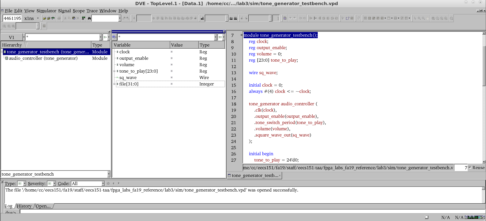
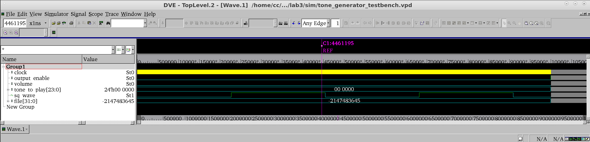

# FPGA Lab 2: Introduction to FPGA Development
<p align="center">
Prof. Sophia Shao
</p>
<p align="center">
TAs: Alisha Menon, Yikuan Chen, Seah Kim
</p>
<p align="center">
Department of Electrical Engineering and Computer Science
</p>
<p align="center">
College of Engineering, University of California, Berkeley
</p>

## Before You Start This Lab
Make sure that you have gone through and completed the steps involved in Lab 1.
Let the TA know if you are not signed up for this class on Piazza or if you do not have a class account (`eecs151-xxx`), so we can get that sorted out.

To fetch the skeleton files for this lab, `cd` to the git repository (`fpga_labs_sp22`) that you had cloned in the first lab and execute the command `git pull`.

Go through the [Verilog Primer Slides wrong link please edit](http://inst.eecs.berkeley.edu/~eecs151/sp22/files/verilog/Verilog_Primer_Slides.pdf); you should feel somewhat comfortable with the basics of Verilog to complete this lab.

Join our [class Slack workspace](https://piazza.com/class/ksp46zb1zfq1u4?cid=50).
We will open a channel for you to ask questions live during each FPGA lab session.

## If you are using your local Windows Vivado

### Create a project in Vivado for this lab
1. In the Vivado launcher, create a new project, select "RTL project". 
2. Add all ".v" files in the "lab2/src/" folder as "design sources", add all ".v" files in the "lab2/sim/" folder as "simulation sources", and add the ".xdc" file in the "lab2/src/" folder as "constraints".
3. Select the pynq-z1 board. **Make sure you have Pynq-z1 board support.** If you don’t have pynq-z1 board support, you could download: https://github.com/cathalmccabe/pynq-z1_board_files, then you can paste this pynq_z1 folder to {Vivado install directory}/data/boards/board_files/ (you need to manually create /board_files folder under /boards if you don’t see one)

### Some simulation and synthesis steps will be different from Linux
1. We will use the GUI Vivado to do simulation, synthesis, implementation, bitstream generating and programming, **not the makefile**.
2. Vivado doesn't recognize some code in the testbenches, and those need to be commented out (see below)

## A Structural and Behavioral Adder Design

### Build a Structural 14-bit Adder
To help you with this task, please refer to the `Code Generation with for-generate loops` slide in the [Verilog Primer Slides](http://inst.eecs.berkeley.edu/~eecs151/sp22/files/verilog/Verilog_Primer_Slides.pdf) (slide 35).

Open `lab2/src/full_adder.v` and **fill in the logic** to produce the full adder outputs from the inputs.

Open `lab2/src/structural_adder.v` and **construct a ripple carry adder** using the full adder cells you designed earlier and a 'for-generate loop'.

Inspect the `z1top.v` top-level module and see how your structural adder is instantiated and hooked up to the top-level signals.
For now, just look at the `user_adder` instance of your structural adder.
As we learned in previous lab, the basic I/O options on the PYNQ-Z1 board are limited.
*How are we getting two 3-bit integers as inputs to the adder from the PYNQ board?*

#### Makefile-Based Build Flow
Here is an overview of the `make` targets available in the `fpga_labs_sp22/labX` folders:
- `make lint` - Lint your Verilog with Verilator; checks for common Verilog typos, mistakes, and syntax errors
- `make elaborate` - Elaborate (but don't synthesize) the Verilog with Vivado and open the GUI to view the schematic
- `make synth` - Synthesize `z1top` and put logs and outputs in `build/synth`
- `make impl` - Implement (place and route) the design, generate the bitstream, and put logs and outputs in `build/impl`
- `make program` - Program the FPGA with the bitstream in `build/impl`
- `make program-force` - Program the FPGA with the bitstream in `build/impl` **without** re-running synthesis and implementation if the source Verilog has changed
- `make vivado` - Launch the Vivado GUI

Running `make program` will run all the steps required to regenerate a bitstream if the Verilog sources have changed.

**Use this flow** to generate a bitstream and program the FPGA.
Try running `make lint` and `make elaborate` before you run `make program`.
*Note*: `make lint` may give you a false warning about a combinational path (`%Warning-UNOPTFLAT`) - you can safely ignore it.

**Try entering** different binary numbers into your adder with the switches and buttons and see that the correct sum is displayed on the LEDs.
If the circuit doesn't work properly on your first try, don't worry and move on to the next section where we simulate the `structural_adder` and you can easily fix bugs.

### Build a Behavioral 14-bit Adder
Check out `lab2/src/behavioral_adder.v`.
It has already been filled with the appropriate logic for you.
Notice how behavioral Verilog allows you to describe the function of a circuit rather than the topology or implementation.

In `z1top.v`, you can see that the `structural_adder` and the `behavioral_adder` are both instantiated in the self-test section.
A module called `adder_tester` (in `src/adder_tester.v`) has been written for you that will check that the sums generated by both your adders are equal for all possible input combinations of `a` and `b`.

If both your adders are operating identically, both RGB LEDs will light up (with red and blue).
Verify this on your board.

## Simulating the Adder
Let's run some simulations on the `structural_adder` in software to check it works.
Typically, this is done before putting our design on the FPGA, but because the adder is simple, we started with the FPGA this time.

To do this, we will need to use a *Verilog testbench*.
A Verilog testbench is designed to test a Verilog module by supplying it with the inputs it needs (stimulus signals) and testing whether the outputs of the module match what we expect.

### Overview of Testbench Skeleton
Check the provided testbench skeleton in `lab2/sim/adder_testbench.v`.
Let's go through what every line of this testbench does.

```verilog
`timescale 1ns/1ns
```

The timescale declaration needs to be at the top of every testbench file.
```verilog
`timescale (simulation time unit)/(simulation resolution)
```

The first argument to the timescale declaration is the simulation time unit.
It specifies how much time *1 unit* of simulation time represents.
In this case, we have defined the simulation time unit to be one nanosecond, so *1 unit* of simulation time equals one nanosecond.

The second argument to the timescale declaration is the simulation resolution, which tells the simulator to model transient behavior of your circuit at that resolution.
In our example it is also 1 nanosecond.
For this lab, we aren't modeling any gate delays, so the resolution can safely equal the time unit.

```verilog
`define SECOND 1000000000
`define MS 1000000
```

These are some macros defined for our testbench.
They are similar to `#define` directives in C.
`define` macros should be used to declare named constants which are used in your RTL or testbench.
For example, in this testbench, `SECOND` is defined as the number of nanoseconds in one second.

```verilog
module adder_testbench();
  // Testbench code goes here
endmodule
```

`adder_testbench` is a testbench module.
It is not intended to be placed on an FPGA, but rather it is to be run by a circuit simulator.
All your testbench code goes in this module.
We will instantiate our DUT (device under test) in this module.

```verilog
reg [13:0] a = 0;
reg [13:0] b;
wire [14:0] sum;
```
Now we declare nets to hold the inputs and outputs that go in and out of the DUT.
Notice that the inputs to the `structural_adder` are declared as `reg` type nets and the outputs are declared as `wire` type nets.
The inputs nets (`a`, `b`) are declared as `reg` since they are assigned inside the testbench's `initial` block.
The output net (`sum`) is declared as `wire` because *any connection to the output of an instantiated module must be a wire*.

*Note*: we can set the initial value of `reg` nets in the testbench to drive a particular value into the DUT at simulation time 0 (e.g. `a`).

```verilog
structural_adder sa (
  .a(a),
  .b(b),
  .sum(sum)
);
```

Now we instantiate the DUT and connect its ports to the nets we have declared in our testbench. **If you use Vivado on windows, please comment out the following code section**

```verilog
initial begin
  `ifdef IVERILOG
      $dumpfile("adder_testbench.fst");
      $dumpvars(0, adder_testbench);
  `endif
  `ifndef IVERILOG
      $vcdpluson;
  `endif
```
This is the body of our testbench.
The `initial begin ... end` block is the "main()" function for our testbench, and where the simulation begins execution.

This block enables simulator-specific waveform dumping for the 2 RTL simulators we are using.
Verilog *system tasks* are prefixed by a dollar sign (e.g. `$dumpfile`).
System tasks are similar to function calls, and they are implemented by the simulator.

```verilog
    a = 14'd1;
    b = 14'd1;
    #(2);
    assert(sum == 'd2);
```

In the `initial` block we drive the DUT inputs using blocking (`=`) assignments.
In Verilog we can construct literal values using the syntax `<bit width>'<radix><value>`.
Here are a few examples:
  - `14'd1` = a 14-bit literal with value = 1 (`d` = radix 10 - decimal)
  - `32'hcafef00d` = a 32-bit literal with value = 0xCAFEFOOD (`h` = radix 16 - hexadecimal)
  - `8'b1010_0001` = an 8-bit literal with value = 0b10100001 (`b` = radix 2 - binary)
      - *note*: Use underscores to make reading the literal easier
  - `'hFFFF_0000` = a 32-bit literal with value = 0xFFFF0000
      - *note*: You can omit the bit width and let Verilog use the minimum number of bits necessary to construct the literal. This is not recommended for RTL, but is often OK for testbenches.

Since the adder is a combinational circuit, once we set its inputs (`a` and `b`), we must advance time for the inputs to propagate to the output (`sum`) through the circuit, before we can inspect the output.

We can advance simulation time using delay statements.
A delay statement takes the form `#(units);`, where *1 unit* represents the simulation time unit defined in `timescale` declaration.
For instance the statement `#(2);` would advance the simulation for 2 time units = 2 * 1ns = 2ns.

After advancing time, `sum` should have the value `2`.
We can use the `assert` statement to check this condition, and if it doesn't hold, the simulator will emit an error.

```verilog
    assert(sum == 'd1) else $display("ERROR: Expected sum to be 1, actual value: %d", sum);
```
Note that you can provide an error message using the `$display` system task which takes a format string and arguments similar to `printf()` in C.

```verilog
    if (sum != 'd20) begin
        $error("Expected sum to be 20, a: %d, b: %d, actual value: %d", a, b, sum);
        $fatal(1);
    end
```
You can also use regular `if` statements to check conditions.
The `$error()` system task also takes a format string and prints an error to the console.
Both the `$error()` system task and `assert` *won't* halt and exit the simulation if there's a failure; you must use the `$fatal()` system task if you want to kill the simulation immediately.

```verilog
    $finish();
end
```
Finally, the `$finish()` system task gracefully exits the simulation.

### Running the Simulation
There are 2 RTL simulators we can use:
- **VCS** - proprietary, only available on lab machines, fast
<!-- - **XSIM** - free, bundled with Vivado, somewhat slower -->
- **Icarus Verilog** - open source, runs on Windows/OSX/Linux, somewhat slower
- **Your local Vivado on Windows** - In the leftmost column of Vivado, you will find Run Simulation

They all take in Verilog RTL and a Verilog testbench module and output:
- A waveform file (.vpd, .vcd, .fst) that plots each signal in the testbench and DUT across time
- A text dump containing anything that was printed during the testbench execution

#### VCS
If you're using the lab machines, you should use VCS.
Run the Makefile from `fpga_labs_sp22/lab2`
```shell
make sim/adder_testbench.vpd
```
This will generate a waveform file `sim/adder_testbench.vpd` which you can view using `dve`.
Login to the lab machines physically or use X2go and run:
```shell
dve -vpd sim/adder_testbench.vpd &
```

<p align="center">

</p>

From left to right, you can see the `Hierarchy`, `Signals`, and `Source Code` windows.
The `Hierarchy` window lets you select a particular module instance in the testbench to view its signals.
In the `Signals` window, you can select multiple signals (by Shift-clicking) and then right-click → 'Add To Waves' → 'New Wave View' to plot the waveforms for the selected signals.

<p align="center">

</p>

Here are a few useful shortcuts:
- **Click on waveform**: Sets cursor position
- **O**: Zoom out of waveform
- **+**: Zoom into waveform
- **F**: Fit entire waveform into viewer (zoom full)
- **Left Click + Drag Left/Right**: Zoom in on waveform section

<!-- #### XSIM
Vivado has an integrated simulator, `xsim`, that can run your Verilog testbench.
You can run XSIM on your laptop.
 -->

#### Icarus Verilog
Icarus Verilog is available on the lab machines.
You can also install Icarus Verilog and gtkwave on your laptop via Homebrew ([iverilog](https://formulae.brew.sh/formula/icarus-verilog), [gtkwave](https://formulae.brew.sh/cask/gtkwave)) or a package manager with Linux or WSL.

Run `make sim/adder_testbench.fst` to launch a simulation with Icarus and to produce a FST waveform file.
You can open the FST by running `gtkwave sim/adder_testbench.fst &` locally or on the lab machines.

#### Your local Vivado on Windows
In the leftmost column of Vivado, you will find Run Simulation. Right click it and click "simulation settings". Make sure you enter the desired simulation time. Then, right click Run Simulation and run it. After the simulation is finished, a waveform tab will appear next to your code tabs.

### Analyzing the Waveform
Open the waveform file using DVE or `gtkwave`.
**Plot** the `a`, `b`, and `sum` signals.
You should be able to see the signals change as specified in the testbench.
For example, you should see the `a` signal start at 1 and then become 0 after 2 ns.

#### Helpful Tip: Reloading Waveforms
When you re-run your simulation and you want to plot the newly generated signals in DVE or gtkwave, you don't need to close and reopen the waveform viewer.
Use Shift + Ctrl + R in gtkwave or File → Reload Databases in DVE to reload the waveform file.

### Exhaustive Testing vs Random Testing
In the `adder_testbench` we have selected just a few values of `a`, `b`, and `sum` to verify.
Is it reasonable to exhaustively test all possible combinations of `a` and `b` for a 14-bit adder in simulation?
At what adder width is it no longer feasible?

You can use a `for` loop (similar to C) in the `initial` block to answer these questions.
```verilog
integer ai, bi;
initial begin
    for (ai = 0; ai < 1024; ai = ai + 1) begin
        for (bi = 0; bi < 1024; bi = bi + 1) begin
            a = ai;
            b = bi;
            // delay + assert
        end
    end
end
```

When exhaustive testing isn't feasible, we often resort to random stimulus instead.
In this case, you can use the `$urandom()` system task to generate an unsigned random number.

```verilog
  a = $urandom();
  b = $urandom();
```

## Build Your First Sequential Digital Circuit
In this section, you will design a 4-bit wrap-around counter that increments every second.
The counter value is shown on the LEDS 0-3 of the PYNQ board.

### Clock Sources
Look at the [PYNQ Reference Manual](https://reference.digilentinc.com/reference/programmable-logic/pynq-z1/reference-manual).
Read Section 11 about the clock sources available on the PYNQ.
We are using the 125 MHz clock from the Ethernet PHY IC on the PYNQ board that connects to pin H16 of the FPGA chip.

Look at the `lab2/src/z1top.v` top-level module and its `CLK_125MHZ_FPGA` input.
```verilog
module z1top (
    input CLK_125MHZ_FPGA,
    ...
);
```

We can access the clock signal from our Verilog top-level module and can propagate this clock signal to any submodules that may need it.

**In `z1top.v`, comment out line 2 to place the counter circuit on the FPGA**, like this:
```verilog
1 | // Comment out this line when you want to instantiate your counter
2 | // `define ADDER_CIRCUIT
```

### Build a 4-bit Counter

Your circuit receives a clock signal with a period of 8 ns (125 MHz). How many clock cycles are equivalent to one second? Note:
```
Time (sec) = Clock Period * Number of cycles
```

Build a 4-bit counter that will increment its value every second (and loop back to 0 once all 4 bits are used), and display the corresponding value on bits `3:0` of the IO LEDs.
There is one caveat: the counter only counts if a 'clock enable' signal (in this case, called `ce`) is 1.
If it's 0, the counter should stay at the same value.

Some initial code has been provided in `src/counter.v` to help you get started.

## Simulating the Counter
See the simulation skeleton in `sim/counter_testbench.v`.

The skeleton has code to generate a clock for the DUT (`counter`):
```verilog
reg clock = 0;
always #(4) clock <= ~clock;
```
We set the value of the clock net to 0 at the very start of the simulation.
The next line toggles the clock signal every 4ns, i.e. half period of 125 MHz clock.

**Your task**: write a testbench for the `counter`.
Set the clock enable (`ce`) signal on and off and step time forward to test your counter.
Use `assert` or `if` statements to verify the proper behavior of the `counter`.

You can use `repeat` and `@(event)` statements, in addition to `#(delay)`, to advance time based on a clock edge.
For example
```verilog
repeat (10) @(posedge clock);
```
will advance time until 10 rising clock edges are seen.

Run the simulation in the same way:
```bash
make sim/counter_testbench.vpd  # vcs
make sim/counter_testbench.fst  # iverilog
```

*Note*: simulating even a simple circuit for 1 second can take a long time.
You may want to modify your `counter` to count up every 1/1000th of a second, so you can run simulation for a shorter duration.
Once your design simulates successfully, you can change a constant in your `counter` to count up every second.

### Analyzing the Simulation
When you open the waveform, you *may* see that your counter signal is just a red line. What's going on?

#### Fixing Unknown Signals
Blue lines (shown as `Z`) in a waveform viewer indicate high-impedance (unconnected) signals.
We won't be using high-impedance signals in our designs, so blue lines or `Z` indicate something in our testbench or DUT isn't wired up properly.

Red lines (shown as `X`) in a waveform viewer indicate a signal has an unknown value.
At the start of simulation, all registers in your DUT contain unknown values.
Since we don't have an explicit reset signal to set registers inside the `counter` to a defined value, it may be unknown for the entire simulation.

Let's fix this.
In the future we will use a reset signal, but for now let's use a simpler technique.
In `src/counter.v` add an initial value to any registers in your design.
```verilog
// Original code:
reg counter;
```

```verilog
// Change to:
reg counter = 0;
```

This tells the simulator that the initial value for this register should be 0.
For this lab, when you add new registers in your counter or any other design module, you should instantiate them with their initial value in the same way.

**Do not set an initial value for a 'wire' type net; it will cause issues with synthesis, and may cause X's in simulation.**

Now run the simulation again until you feel confident in your design.

## Put the Counter on the FPGA

Once you're confident that your counter works, program the FPGA using the make-based flow as before.
`z1top` connects your counter to the 125 MHz clock and connects switch 0 as the clock enable signal.
If done correctly, LEDs 0 through 3 should continually count up by 1 each second.

This process, where we use simulation to verify the functionality of a module before programming it onto the FPGA, will be the one we use throughout this semester.

## Lab Deliverables
### Lab Checkoff (due: next lab)
To checkoff for this lab, have these things ready to show the TA:
  - Your FPGA, programmed with the adder circuit and with both RGB LEDs (LEDs 4 and 5) lit up showing correctness. Be ready to explain how your structural adder works.
  - A waveform of the testbench you wrote for your counter and its clock enable functionality.

No lab report this week!

## Acknowledgement
This lab is the result of the work of many EECS151/251 GSIs over the years including:
- Sp12: James Parker, Daiwei Li, Shaoyi Cheng
- Sp13: Shaoyi Cheng, Vincent Lee
- Fa14: Simon Scott, Ian Juch
- Fa15: James Martin
- Fa16: Vighnesh Iyer
- Fa17: George Alexandrov, Vighnesh Iyer, Nathan Narevsky
- Sp18: Arya Reais-Parsi, Taehwan Kim
- Fa18: Ali Moin, George Alexandrov, Andy Zhou
- Sp19: Christopher Yarp, Arya Reais-Parsi
- Fa19: Vighnesh Iyer, Rebekah Zhao, Ryan Kaveh
- Sp20: Tan Nguyen
- Fa20: Charles Hong, Kareem Ahmad, Zhenghan Lin
- Sp21: Sean Huang, Tan Nguyen
- Fa21: Vighnesh Iyer, Charles Hong, Zhenghan Lin, Alisha Menon
- Sp22: Alisha Menon, Yikuan Chen, Seah Kim
