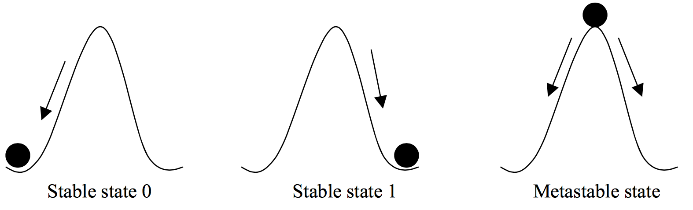
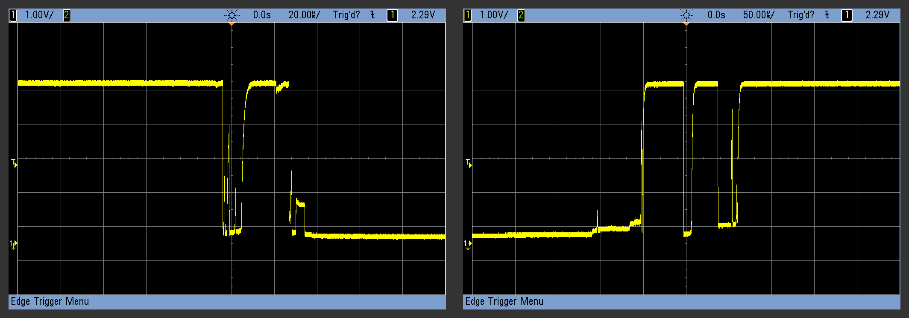
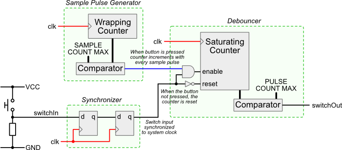
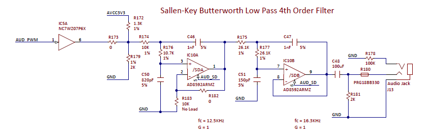
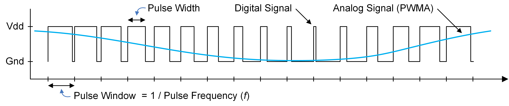

# FPGA Lab 3: More Sequential Circuits, Audio "DAC"
<p align="center">
Prof. Sophia Shao
</p>
<p align="center">
TAs: Alisha Menon, Yikuan Chen, Seah Kim
</p>
<p align="center">
Department of Electrical Engineering and Computer Science
</p>
<p align="center">
College of Engineering, University of California, Berkeley
</p>

## Before You Begin
### Fetch Latest Lab Skeleton
```shell
cd fpga_labs_sp22
git pull origin master
```

### Verilog Reading
Look through these documents if you haven't already.

- [Verilog Primer Slides](https://inst.eecs.berkeley.edu/~eecs151/sp22/files/verilog/Verilog_Primer_Slides.pdf) - overview of the Verilog language
- [wire vs reg](https://inst.eecs.berkeley.edu/~eecs151/sp22/files/verilog/wire_vs_reg.pdf) - the differences between `wire` and `reg` nets and when to use each one
- [always @ blocks](https://inst.eecs.berkeley.edu/~eecs151/sp22/files/verilog/always_at_blocks.pdf) - understanding the differences between the two types of `always @` blocks and what they synthesize to

## Overview
In this lab we will:

- Build input conditioning circuits so we can safely use the buttons as inputs to sequential circuits
  - Write parameterized Verilog modules
  - Use fork/join simulation threading in Verilog testbenches
  - Test the button signal chain on the FPGA
- Create an audio "DAC" using a PWM generator
- Write a square wave signal generator
  - Test the circuit on the FPGA
  <!-- - Enable variable frequency generation -->

## Additional Testbench Constructs
The testbenches provided in this lab use some constructs we haven't covered yet.
Here is an overview of constructs you should know:

- `@(posedge <signal>)` and `@(negedge <signal>)`
    - These are event trigger statements which are similar to the delay statements you've seen before
    - `#10` advances the simulation by 10 timesteps
    - `@(posedge <signal>)`/`@(negedge <signal>)` will advance the simulation until the `<signal>` rises/falls.
    - For example, this block will advance simulation time until we have seen two rising edges of `clock`:
    ```verilog
    @(posedge clock);
    @(posedge clock);
    ```

- `repeat`
    - Acts like a `for` loop but without an increment variable
    - For example, this block will advance the simulation until we have seen 2 falling clock edges, and will then advance further until we have seen 10 rising clock edges.
    ```verilog
    repeat (2) @(negedge clk);
    repeat (10) begin
        @(posedge clk);
    end
    ```

- `$display`
    - A print statement. Similar to `printf` in C. You call `$display()` with a format string and arguments.
    ```verilog
    $display("Wire x in decimal is %d", x);
    $display("Wire x in binary is %b", x);
    // You can even print out the current simulation time
    $display("Time %d", $time);
    ```
    - Lab 2 covered `$error()` which works like `$display()`, but is used to print an error message

- **Tasks**
    - Tasks are subroutines that can group together simulation commands (similar to functions).
    - They can take inputs and assign outputs. They can be called like functions in an `initial` block.
    ```verilog
    task wait_for_n_clocks();
    input [7:0] num_edges;
    begin
      repeat (num_edges) @(posedge clk);
    end
    endtask

    initial begin
        a = 16'd1;
        b = 16'd3;
        wait_for_n_clocks(10);
        assert(sum == 16'd4);
    end
    ```

- `fork`/`join`
    - Allows you to execute blocks simulation code in parallel. You create a fork block with the keyword `fork` and end the block with the keyword `join`.
    ```verilog
    fork
      begin
        task1();
      end
      begin
        $display("Another thread");
        task2();
      end
    join
    ```
    - Multiple threads of execution are created by putting multiple begin/end blocks in the fork-join block.
    - In this example, thread 1 runs `task1()`, while thread 2 first `$display`s some text then runs `task2()`. The threads run in parallel.

- Hierarchical Paths
    - You can access signals *inside* an instantiated module for debugging purposes using `.` to provide a path to the signal. This can be helpful in some cases where you want to look at an internal signal but don't want to create another output port just for debug.
    ```verilog
    // RTL
    module m(input [1:0] a, output y);
        wire q; // internal signal
        assign q = |a
        assign y = ~q;
    endmodule
    ```
    ```verilog
    // Testbench
    m dut(.a(a), .y(y));
    $display("a: %d", a);
    $display("dut.q: %d", dut.q);
    ```

## Input Conditioning Circuits
We want to use the buttons as inputs to a sequential circuit. For example, we may want to press a button to increment a counter, and press another one to decrement a counter.

However, there are a few issues with using the raw button signals in our circuits:
  - A button press is an asynchronous signal (it is not aligned to any clock edge): we need to sample the button signal safely from our 125 MHz clock domain
  - When we press a button, we want a signal that goes high for only one clock cycle indicating a single press: we need to detect the rising edge of the button signal
  - When a button is pressed, the connection of the button net to VDD isn't instant and clean (the button *bounces*): we need to add hysteresis

### Synchronizer
In synthesizable Verilog (RTL), digital signals are either 0's or 1's (low/high voltage level).
If the circuit is well designed and timed (fully synchronous), we only have to worry about the low and high voltage states.

The signals coming from the push buttons and slide switches on the PYNQ board don't have an associated clock (they are asynchronous).
When the button signals are put through a register, its hold or setup time requirements may be violated.
This may put that register into a *metastable* state.

<p align=center>
  

<p align=center>
  <em>The `ball on a hill' metaphor for metastability. If a register's timing constraints are violated, its output voltage oscillates and after some time unpredictably settles to a stable state.</em>
</p>

In a fully synchronous circuit, the timing tools will determine the fastest clock frequency under which the setup time constraints are all respected and the routing tools will ensure that any hold time constraints are handled.
An asynchronous signal could violate timing constraints, make the output of the register metastable, and violate more downstream constraints: making the circuit fail.

We will implement a synchronizer circuit that will safely bring an asynchronous signal into a clock domain.
The synchronizer needs to have a very small probability of allowing metastability to propagate into our synchronous circuit.

The synchronizer circuit for this lab is simple.
<p align=center>
  
</p>
<p align=center>
  <em>1-bit 2 Flip-Flop Synchronizer</em>
</p>

For synchronizing one bit, it is a pair of flip-flops connected serially.

**Edit** `lab3/src/synchronizer.v` to implement the two flip-flop synchronizer.
This module is parameterized by a `WIDTH` parameter which controls the number of one-bit signals to synchronize.

A testbench is provided in `lab3/sim/sync_tb.v`. **Run the testbench** with `make sim/sync_tb.vpd` (VCS) or `make sim/sync_tb.fst` (Icarus Verilog) as usual.

### Edge Detector
We want to convert the low-to-high transition of a button press to a 1 clock cycle wide pulse that the rest of our design can use.

**Implement** a parameterized-width edge detector in `lab3/src/edge_detector.v`.

A testbench is provided in `lab3/sim/edge_detector_tb.v`. **Run it as usual**.

The edge detector testbench tests that your `edge_detector` outputs a 1 cycle wide pulse when its corresponding input transitions from 0 to 1.
You should **visually inspect the waveform** to verify the correct behavior too.

### Debouncer
When we press or depress a button, the signal doesn't behave like a perfect step function.
Instead the button signal is glitchy due to mechanical 'bounce'.

<p align=center>
  
</p>
<p align=center>
  <em>Scope waveform of button bounce when pressing and depressing a button.</em>
</p>

If we naively used the button signal directly, there would be many spurious "button presses".
The debouncer circuit takes a button's glitchy digital signal and outputs a clean high-to-low signal indicating a single button press.

<p align=center>
  
</p>
<p align=center>
  <em>Architecture of a simple debouncer circuit. <a href="http://www.labbookpages.co.uk/electronics/debounce.html">Source</a></em>
</p>

The debouncer consists of:
  - **Sample Pulse Generator** - Tells our saturating counter when to sample the input signal. It should output a 1, every `SAMPLE_CNT_MAX` clock cycles. By default `SAMPLE_CNT_MAX` is set to 65000.
  - **Saturating Counter** - This is a counter that counts up to and including `PULSE_CNT_MAX` (and saturates).

The circuit implementation has the following behavior:
  - All counters should start at 0.
  - If the sample pulse generator emits a 1 on a clock edge, increment the saturating counter if the input signal is also 1, else reset the saturating counter to 0.
  - Once the saturating counter reaches `PULSE_CNT_MAX`, it should hold that value indefinitely until the sampled input signal becomes 0.
  - The `debounced_signal` of your debouncer should be an equality check between the saturating counter and `PULSE_CNT_MAX`.

**Implement** the debouncer in `lab3/src/debouncer.v`.
You can use the same sample pulse generator for all input signals into your `debouncer`, but you should have a separate saturating counter per input signal.

#### Debouncer Implementation Notes
You may find it helpful to create a 2D `reg` to hold the saturating counters for each input.
Here is an example:
```verilog
reg [7:0] arr [3:0]; // 4 X 8-bit array
arr[0]; // First byte from arr (8 bits)
arr[1][2]; // Third bit of 2nd byte from arr (1 bit)
```

A testbench is provided in `lab3/sim/debouncer_tb.v`. Make sure you **understand what the testbench is doing**. **Run it** as usual.

The debouncer testbench has 2 tests:

  - Verifies that if a glitchy signal initially bounces and then stays high for *less* than the saturation time, that the debouncer output never goes high.
  - Verifies that if a glitchy signal initially bounces and then stays high for *more* than the saturation time, that the debouncer goes high and stays high until the glitchy signal goes low.

#### Debouncer Testbench Notes
If you are seeing issues where certain registers are red lines (X's), make sure you give them an initial state.
Use the following code to initialize a 2D reg in `debouncer.v`:

```verilog
reg [X:X] saturating_counter [X:X];
integer k;
initial begin
  for (k = 0; k < WIDTH; k = k + 1) begin
    saturating_counter[k] = 0;
  end
end
```
### Button Parser on the FPGA
Now that we have tested all the modules required to produce a clean, stable button press signal.
It's time to put everything together.

#### Counter with Button Parser
**Look** at `src/button_parser.v` which combines the synchronizer, debouncer, and edge detector in a chain.

Then **look** at `src/counter.v` which implements a simple up/down counter controlled by button presses.
**Observe** how these 2 modules are connected at the top-level in `src/z1top.v`.

**Run the FPGA build flow** to put the counter on the FPGA and verify it works as expected.
You may get some `%Warning-WIDTH` errors in your `debouncer` from running `make lint`: these can be safely ignored if they involve the module parameters.

**Look** at `src/button_parser.v` which combines the synchronizer, debouncer, and edge detector in a chain.

#### For Windows Users
You may need to change `rtoi` to `floor` instead in `src/z1top.v`

#### Counter Testbench
**Write** a testbench from scratch for `counter.v` in `sim/counter_tb.v`.
Make sure you use asserts or `$error` statements that verify the correct functionality.
Use the provided testbenches and your `counter_testbench` from lab2 as a guide.

#### Play and Pause your Counter
Right now, your `counter` is in a static mode; you can only increment or decrement the counter value for each button press.
**Modify** `counter.v` such that when you press `buttons[2]`, your counter starts incrementing every one second (running mode), and pauses when you press BTN2 again (static mode).

You can incorporate the code your wrote from lab2.
Use the `CYCLES_PER_SECOND` parameter in `counter.v` to set the threshold for your cycle counter.

**Extend** `sim/counter_tb.v` to test changing between running and static mode.
In your testbench, you can **override** `CYCLES_PER_SECOND` when instantiating your `counter` to make simulation fast.

<!-- We'd like suggest that you think about the structure of your design ahead of coding. The debouncer circuit figure above is a great example. Remember that Verilog coding is all about describing your hardware circuit! Sketch a block diagram of your mode counter circuit in terms of the \texttt{button\_parser} block and some register blocks from \verb|lib/EECS151.v| as you see fit. Label the relevant input and output signals. Feel free to use any logic gates, MUXes, or adders. Don't worry about listing all the details. Submit your sketched diagram in your report. -->

## PWM DAC
### Audio Out
Look at Section 14 of the [Pynq Reference Manual](https://reference.digilentinc.com/reference/programmable-logic/pynq-z1/reference-manual) which describes the mono audio out feature on the Pynq board.

<p align=center>
  
</p>

The FPGA pin R18 is connected to the `AUD_PWM` net.
The FPGA can drive this net with a PWM signal which goes through a low-pass filter and is driven into the audio jack on the Pynq board.

There's also an `AUD_SD` net connected to FPGA pin T17, which turns off the opamps in the low-pass filter.
Setting `AUD_SD` to 1 enables the audio output.

Find these signals in the `src/z1top.xdc` file, and note how they appear in the `src/z1top.v` port list.

### PWM Generator as DAC
Since we have a fast 125 MHz clock, we can generate a PWM signal to drive the `AUD_PWM` net.

<p align=center>
  
</p>

Let's make the pulse window **1024 cycles** of the 125 MHz clock.
This gives us 10 bits of resolution, and gives a PWM frequency of `125MHz / 1024 = 122 kHz` which is much greater than the filter cutoff.

**Implement** the circuit in `src/dac.v` to drive the `pwm` output based on the `code` input.
The `code` is the number of clock cycles in the pulse window during which the `pwm` output should be high.

For example:
  - If `code = 0`, `pwm` should be 0 for the entire pulse window (1024 cycles)
  - If `code = 1023`, `pwm` should be 1 for the entire pulse window
  - If `code = 511`, `pwm` should be 1 for cycles 0 - 511 and 0 for cycles 512-1023

You can assume that `code` will only change every 1024 cycles.

The DAC should also output a signal called `next_sample` to tell the outside world that it can safely change the `code` before another pulse window begins.
`next_sample` should be 1 on the final cycle of the pulse window.

### DAC Testbench
**Run the testbench** in `sim/dac_tb.v` to verify this functionality - check the waveform too.
*Note*: the testbench sets `CYCLES_PER_WINDOW` to 8 to make the simulation easier to debug.

### Square Wave Generator
Now we have a DAC, but we need to give it samples to play.
**Write a square wave sample generator** in `src/sq_wave_gen.v` which takes a 125 MHz clock and the `next_sample` signal from the DAC, and outputs the `code` for it to play.

`next_sample` indicates when the `sq_wave_gen` module should emit a new sample of the 440 Hz square wave.
When `next_sample` is high, you should emit the next sample of the square wave on the `code` output on the next rising clock edge.
When `next_sample` is low, you should freeze the state of your module since the outside world isn't requesting a new sample.

<!-- The `code` should be held constant while `next_sample` is low, and on the cycle when `next_sample` is high, the `code` can change on the next rising edge. -->

The square wave generator should output the codes for a 440 Hz square wave.
*Note*: `125e6 / 1024 / 440 / 2 = 138.7 ~ 139`

When the square wave is high, the `code` should be 562, and when the square wave is low, the `code` should be 462.
Avoid using the full `code` range from 0-1023 to keep the volume low.

### Square Wave Generator Testbench
We have provided a simple testbench in `sim/sq_wave_gen_tb.v` which pulls about 1 second worth of samples (`125e6 / 1024 = 122070`) from your `sq_wave_gen` module and writes them to a file in `sim/codes.txt`.

You can run a script to convert this text file to an audio file:
`cd lab3 && ../scripts/audio_from_sim sim/codes.txt`

Play the `output.wav` audio file using `play output.wav`.
Verify this sounds like a 440 Hz square wave; [use this website](https://www.szynalski.com/tone-generator/) for reference.
Keep your volume low - square waves are harsh.

### On the FPGA
**Look** at `src/z1top.v` to see how the `dac` and `sq_wave_gen` are connected.
Use the standard flow to **generate a bitstream**.
**Program** the FPGA, plug headphones into the audio out port, and verify that you hear a 440 Hz tone without any glitching.
Use `SWITCHES[1]` to toggle the sound on and off.

## Lab Deliverables
### Lab Checkoff (due: next lab)
To checkoff for this lab, have these things ready to show the TA:
  - A counter testbench and its waveform
  - A functioning button parser that you can use to control the counter in running and static mode
  - A functioning DAC that can emit a fixed 440Hz square wave tone

## Acknowledgement
This lab is the result of the work of many EECS151/251 GSIs over the years including:
- Sp12: James Parker, Daiwei Li, Shaoyi Cheng
- Sp13: Shaoyi Cheng, Vincent Lee
- Fa14: Simon Scott, Ian Juch
- Fa15: James Martin
- Fa16: Vighnesh Iyer
- Fa17: George Alexandrov, Vighnesh Iyer, Nathan Narevsky
- Sp18: Arya Reais-Parsi, Taehwan Kim
- Fa18: Ali Moin, George Alexandrov, Andy Zhou
- Sp19: Christopher Yarp, Arya Reais-Parsi
- Fa19: Vighnesh Iyer, Rebekah Zhao, Ryan Kaveh
- Sp20: Tan Nguyen
- Fa20: Charles Hong, Kareem Ahmad, Zhenghan Lin
- Sp21: Sean Huang, Tan Nguyen
- Fa21: Vighnesh Iyer, Charles Hong, Zhenghan Lin, Alisha Menon
- Sp22: Alisha Menon, Yikuan Chen, Seah Kim
