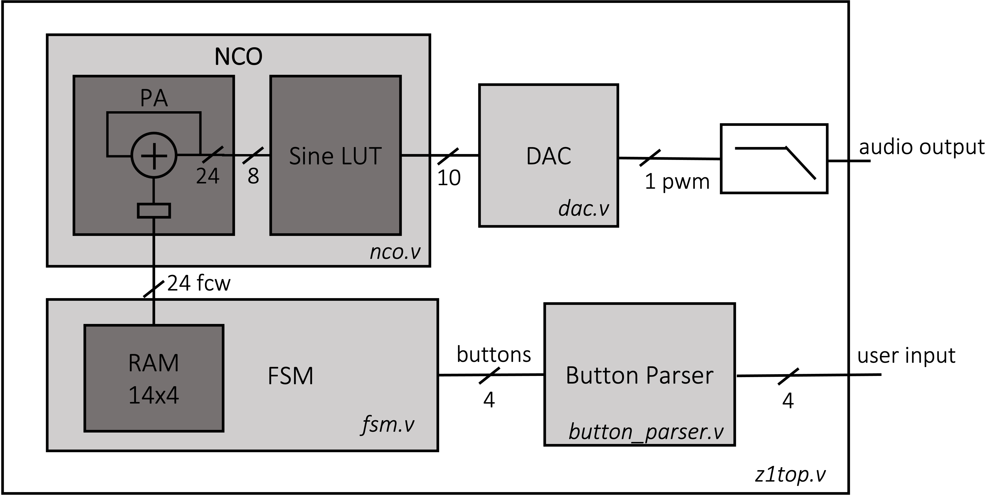

# FPGA Lab 4: Tunable Wave Generator, NCO, FSMs, RAMs
<p align="center">
Prof. Sophia Shao
</p>
<p align="center">
TAs: Alisha Menon, Yikuan Chen, Seah Kim
</p>
<p align="center">
Department of Electrical Engineering and Computer Science
</p>
<p align="center">
College of Engineering, University of California, Berkeley
</p>

## Before You Begin

### Fetch Latest Lab Skeleton
```shell
cd fpga_labs_sp22
git pull origin master
```

### Copy Sources From Previous Lab
```shell
cp lab3/src/synchronizer.v lab3/src/debouncer.v lab3/src/edge_detector.v lab4/src
```

### Reading
Look through these documents if you haven't already.

- [Verilog Primer Slides](https://inst.eecs.berkeley.edu/~eecs151/sp22/files/verilog/Verilog_Primer_Slides.pdf) - overview of the Verilog language
- [FSM](https://inst.eecs.berkeley.edu/~eecs151/sp22/files/verilog/verilog_fsm.pdf) - Finite State Machines in Verilog

## Overview
In this lab we will:

- Extend the functionality of the square wave generator we built in lab3
  - Use the buttons to adjust the output wave frequency
- Write a Numerically Controlled Oscillator (NCO)
  - Initialize a ROM with a binary file, and use it as an LUT
  - Design a phase accumulator (PA)
- Design an FSM
  - Use buttons to switch between states
  - Use the FSM to control the NCO using a RAM
  - Test the circuit on FPGA

## Part 1: Tunable Square Wave Generator
In lab 3, we built a simple square wave generator which can emit a fixed 440Hz square wave tone. We would like to add more functionality.

### Implementation
Support 2 modes of frequency adjustment:
  - *Linear Period Adjustment*: increase the frequency of the square wave linearly using the `STEP` parameter to determine how much to adjust the square wave period for every button press
  - *Exponential Period Adjustment*: double or halve the period of the square wave for every button press (*hint*: use bitshifts)

Use the button inputs as follows:
  - `button[0]` to increase the square wave frequency (decrease period)
  - `button[1]` to decrease the square wave frequency (increas period)
  - `button[2]` to switch between the 2 modes of frequency adjustment (linear period step/exponential)

Use `leds[0]` to display the frequency adjustment mode. The other `leds` can be set as you wish.

Since we now have a working button parser, we will use an explicit reset signal (`rst`) to make sure our registers don't hold undefined values (`X`) during simulation, and to gain the ability to reset our circuits at runtime.
When `rst` is high on a rising clock edge, you should reset any registers in your circuit and reset the square wave frequency to 440 Hz.

**Manually copy your DAC** from `lab3/src/dac.v` to `lab4/src/dac.v`. **Use the new `rst` signal** to reset registers inside your DAC *instead of* using initial values. Example:
```verilog
// Initial register value - Don't do this anymore
reg [4:0] counter = 0;
```

```verilog
// Explicit reset - Do this
reg [4:0] counter;
always @(posedge clk) begin
  if (rst) counter <= 0; // counte value will be undefined before rst. This is what we want.
end
```

Use your solution from lab 3 to **implement the new square wave generator** in `src/sq_wave_gen.v`.
You should support a square wave frequency range from 20 Hz to 10 kHz. (hint: calculate the corresponding period...)

### Verification
**Extend the testbench** in `sim/sq_wave_gen_tb.v` to verify the reset and frequency adjustment functionality of your `sq_wave_gen`.
Make sure your RTL can handle overflow (what happens when you keep pressing the same button?)

The testbench has 2 simulation threads
  - The first one pulls samples from the `sq_wave_gen` at random intervals
  - The second one is for you **to write by simulating button presses**. You should use the `num_samples_fetched` variable to advance time in the simulation.
    - *Note*: the sample rate is `125e6 / 1024 = 122 kHz`
    - *Example*: to wait for a quarter of a second, you can use the delay statement `@(num_samples_fetched == 30517)`

You can use the same script from lab 3 to convert the simulation output to an audio file.
```shell
../scripts/audio_from_sim sim/codes.txt
play output.wav
```

### FPGA
Look at `src/z1top.v` to see how the new `sq_wave_gen` is connected.
Use `SWITCHES[1]` to turn the audio output on/off, and keep `SWITCHES[0]` low to use the `sq_wave_gen` module to drive the DAC.

Use `make impl` and `make program` to **put the circuit on the FPGA and test it**.

## Part 2: NCO
The top level schematic for the rest of this lab is shown below:

<p align=center>
  
</p>

### NCO Overview
Now we can generate tunable square waves using `sq_wave_gen`, but 1) they sound harsh and 2) we want to create a more general wave generation circuit that has frequency control and supports arbitrary waveform types.

Let's use a numerically controlled oscillator (NCO) to generate sine waves.
Here's the math involved:

A **continuous time** sine wave, with a frequency , can be written as:

<p align=center>

</p>

If this sine wave is sampled with sampling frequency (so the audio could be stored as a bunch of numbers) ( in our case), the resulting stream of discrete time samples is:

<p align=center>

</p>

We want to let our hardware output such stream of samples. One way to do this is to use a **lookup table (LUT)** and a **phase accumulator** (PA, just a register that can increment its value).

Say we have a LUT that contains sampled points for one period of a sine wave with  entries. The entries `i`  of this LUT are:

<p align=center>

</p>

To find the index ***i*** of the LUT that stores the ***n-th sample***, we can equate the expressions inside :

<p align=center>

</p>
<p align=center>

</p>

This means that to calculate sample `n+1` for a given , we should take the LUT index ***i*** that corresponds to sample `n` and increment the index by the **frequency control word (FCW)** (also called the **phase increment** in the equation above).

To find the frequency step,  , of the NCO (a.k.a frequency resolution) we can look at how much of a change in  could cause the FCW, or phase increment, to increase by 1:

<p align=center>

</p>
<p align=center>

</p>

In the equaltion above,  is th total number of frequencies we could represent using N bits. In this lab we will use `N=24`. Recall that in lab 3, our DAC has a frequency of `122kHz`, which means the frequency resolution is `0.007Hz`. We can have very precise frequency control using an NCO.

However, a  entry LUT is huge and wouldn't fit on the FPGA. So, we will keep the phase accumulator `N` (24-bits) wide, and only use the MSB `M` bits to index the sine wave LUT. This means the LUT only contains  entries, where `M` can be chosen based on the tolerable phase error. **We will use `M = 8` in this lab.**

### NCO Implementation
We’ve generated a file that contains the contents of the LUT for you in `src/sine.bin`. You can run the following command to re-generate it:
```shell
python scripts/nco.py --sine-lut > sine.bin
```

We can use the file to initialize a ROM inside `src/nco.v`. Use `$readmemb()` to load a ROM with initial contents like this:
```verilog
reg [9:0] sine_lut [0:255];
initial begin
    $readmemb("sine.bin", sine_lut);
end
```
If you are running a simulation in GUI Vivado, you must add this file to sim sources.

**Implement** the NCO in `src/nco.v`. Note that the PA uses the main clock and runs at 125MHz.
When `next_sample` is high, you should output a new DAC code on `out` on the next rising clock edge, similar to the `sq_wave_gen`.
You can assume that `fcw` can change only when `next_sample` isn't high.

### NCO Verification
We have provided a testbench for the NCO in `sim/nco_tb.v`.
It is similar to `sim/sq_wave_gen_tb.v` in that it uses one thread to dump to fetch samples from the `NCO` and dumps them to a file called `nco_codes.txt`, and it uses another thread to set `fcw`.

You can run the testbench as usual, with the provided assertions.
You should also **modify the testbench** to produce a 440 Hz tone using the NCO by setting the correct `fcw`.
You can use the same script to convert the sample outputs to an audio file.

```shell
../scripts/audio_from_sim sim/nco_codes.txt
play output.wav
```

### If you are on Windows
You could use any python tool (recommend PyCharm) to run the script above. Then just use any media player to play the .wav file.

Verify the simulated output sounds like a [pure sine tone at 440 Hz](https://www.szynalski.com/tone-generator/) rather than the harsh sound produced by a square wave generator.

### NCO on FPGA
Look through `src/z1top.v` for the instantiation of the `nco`.
Note that the `fcw` comes from an FSM which we will implement in the next part.
Also note that `SWITCHES[0]` controls whether the square wave circuit (0) or the NCO (1) is playing through the audio jack and `SWITCHES[1]` can be used to mute the audio (0 = mute, 1 = active).

For now, hard-code `fcw` to the value required to play a 440 Hz tone.
```verilog
    //.fcw(fcw),
    .fcw(24'd____),
```

Run `make impl` and `make program`, and make sure you hear a 440 Hz sine wave when you plug in headphones to the audio jack.

## Part 3: FSM + Note Sequencer (RAM)

### Sequencer RAM
We want to implement a sequencer that holds 4 notes (FCWs) and plays each note for 1 second through the NCO in a loop.
We have provided a RAM that's used to hold and modify these 4 notes.
See `src/fcw_ram.v` for a skeleton of a RAM with 1 read/write port.
Note that both read and write are *synchronous*.

The RAM contains 4 24-bit values, which correspond to the FCWs for the 4 notes.
Initially (upon reset) the RAM should hold these 4 notes:
  - 440 Hz (A4)
  - 494 Hz (B4)
  - 523 Hz (C5)
  - 587 Hz (D5)

**Calculate** the corresponding FCWs and **edit the reset block** in `src/fcw_ram.v` with the values you calculated.

### FSM Specification
With the sequencer RAM in place, we want to design and implement an FSM that will use the buttons to play, reverse-play, and pause the playback of the 4 notes in the sequencer RAM.

The FSM takes the lower 3 buttons as inputs and outputs the values for 4 LEDs and the FCW for the NCO.
A skeleton is provided in `src/fsm.v`.

The FSM has 4 states: `REGULAR_PLAY`, `REVERSE_PLAY`, `PAUSED`, `EDIT`.
Here is the state transition diagram:

<p align=center>
  
</p>

- The initial state should be `REGULAR_PLAY`. In this state, the FSM should play the notes in the RAM one by one (440Hz -> 494Hz -> 523Hz -> 587Hz). Each note should be played for 1 second.
- Pressing the play-paused button (`button[0]`) should transition you into the `PAUSED` state from either the `REGULAR_PLAY` or `REVERSE_PLAY` states. Pressing the same button while in the `PAUSED` state should transition the FSM to the `REGULAR_PLAY` state.
- In the `PAUSED` state, the RAM address should be held steady at its value before the transition into `PAUSED`, and the NCO should freeze (e.g. set `fcw` to 0). After returning to the `REGULAR_PLAY` state, the RAM address should begin incrementing again from where it left off.
- You can toggle between the `REGULAR_PLAY` and `REVERSE_PLAY` states by using the reverse button (`button[1]`). In the `REVERSE_PLAY` state, you should decrement the RAM address by 1 rather than increment it by 1 every second.
- The `EDIT` state can only be entered when the edit button (`button[2]`) is pressed in the `PAUSED` state. In the `EDIT` state, the current note should come out of the speaker continuously. Pressing `button[0]` will decrease the frequency of the current tone, while pressing `button[1]` should increase the frequency. You can decide the step at will and it doesn’t have to be linear. Pressing the edit button should transition the FSM back to the `PAUSED` stage.
- If the FSM is reset (`rst`) it should return to the `REGULAR_PLAY` state, and the RAM should be reset to its original values.
- If you don't press any buttons, the FSM shouldn't transition to another state.
- Keep in mind, when doing a reset, we cannot write the current note into the ram (what should wr_en look like?)
- Make sure your note doesn't underflow or overflow beyond the min/max frequency.

The `leds` output should track which note you are playing (one-hot).
The `leds_state` output should represent the state your FSM is in using 2 bits.

We have provided a skeleton in `src/fsm.v`.
If you would like to use a different implementation, feel free to modify it.

### FSM Testbench
We have provided an FSM testbench skeleton in `sim/fsm_tb.v`.

You should **edit it** to simulate pressing buttons and verifying the FSM behaves correctly.
Make sure you test all the state transitions.

You can override `CYCLES_PER_SECOND` when instantiating `fsm` to speed up simulation (as before).

### Put Everything Together
Check the top-level diagram again.
Make sure that all modules are connected as desired in `src/z1top.v` (remove the `fcw` hardcoding from the previous part).

**Program the FPGA**.
Plug headphones into the audio out port, press the reset button, and verify that you hear the notes in the sequencer RAM play one after the other.
Use the buttons to switch between different states.

## Lab Deliverables
### Lab Checkoff (due: next lab)
To checkoff for this lab, have these things ready to show the TA:
  - Demonstrate the tunable square wave generator on the FPGA (reset, linear/exponential frequency adjustment)
  - Demonstrate the FSM on the FPGA (FSM with play, reverse play, pause, edit, and reset)
No lab report this week!

## Acknowledgement
This lab is the result of the work of many EECS151/251 GSIs over the years including:
- Sp12: James Parker, Daiwei Li, Shaoyi Cheng
- Sp13: Shaoyi Cheng, Vincent Lee
- Fa14: Simon Scott, Ian Juch
- Fa15: James Martin
- Fa16: Vighnesh Iyer
- Fa17: George Alexandrov, Vighnesh Iyer, Nathan Narevsky
- Sp18: Arya Reais-Parsi, Taehwan Kim
- Fa18: Ali Moin, George Alexandrov, Andy Zhou
- Sp19: Christopher Yarp, Arya Reais-Parsi
- Fa19: Vighnesh Iyer, Rebekah Zhao, Ryan Kaveh
- Sp20: Tan Nguyen
- Fa20: Charles Hong, Kareem Ahmad, Zhenghan Lin
- Sp21: Sean Huang, Tan Nguyen
- Fa21: Charles Hong, Vighnesh Iyer, Alisha Menon, Zhenghan Lin
- Sp22: Alisha Menon, Yikuan Chen, Seah Kim
