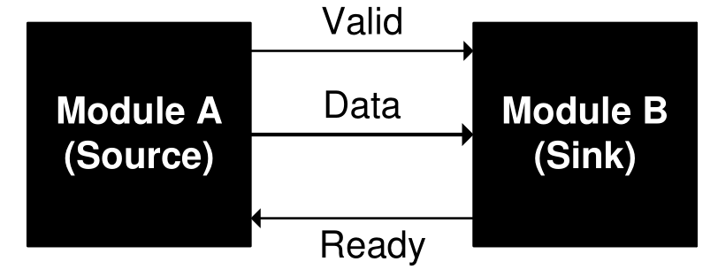
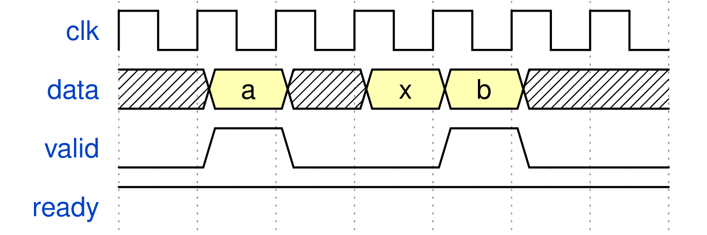
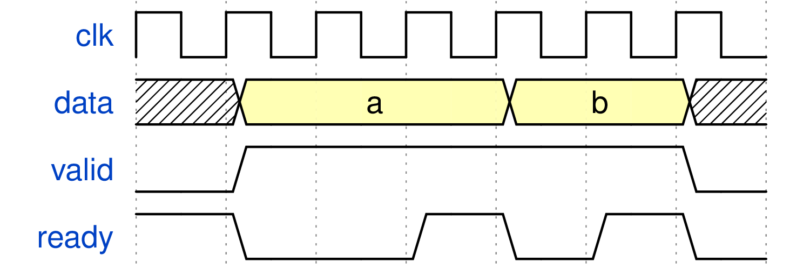
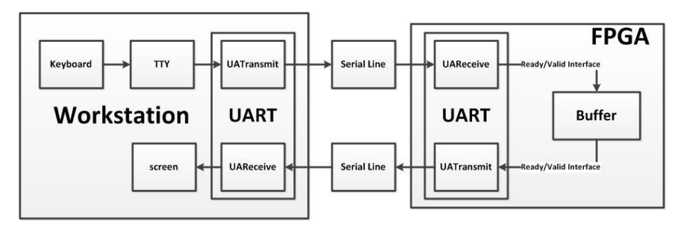
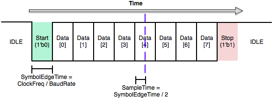
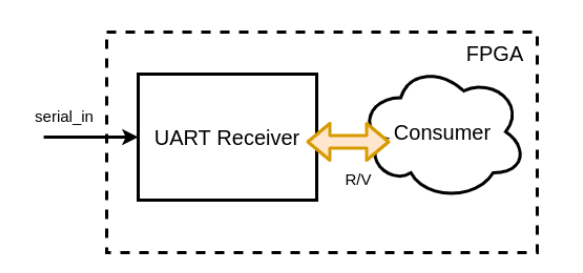
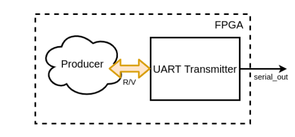
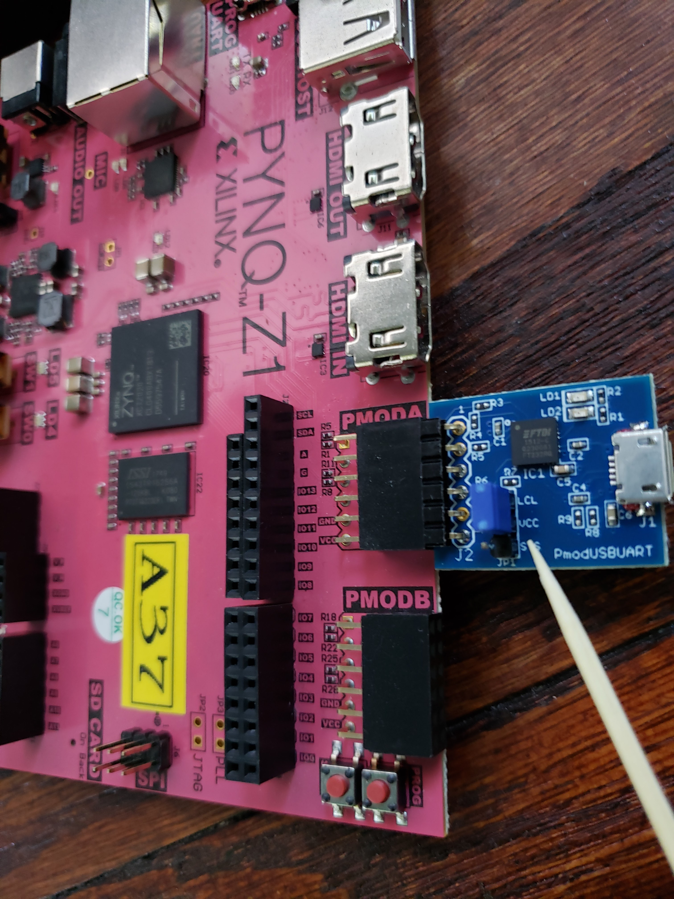

# FPGA Lab 5: UART (Universal Asynchronous Receiver/Transmitter)
<p align="center">
Prof. Sophia Shao
</p>
<p align="center">
TAs: Alisha Menon, Yikuan Chen, Seah Kim
</p>
<p align="center">
Department of Electrical Engineering and Computer Science
</p>
<p align="center">
College of Engineering, University of California, Berkeley
</p>

## Before You Begin
### Fetch Latest Lab Skeleton
```shell
cd fpga_labs_sp22
git pull origin master
```

### Copy Sources From Previous Lab
```shell
cd fpga_labs_sp22
cp lab4/src/synchronizer.v lab5/src/.
cp lab4/src/edge_detector.v lab5/src/.
cp lab4/src/debouncer.v lab5/src/.
```

### Reading
- Read this document on [ready-valid interfaces](https://inst.eecs.berkeley.edu/~eecs151/fa21/files/verilog/ready_valid_interface.pdf)

## Overview
In this lab we will:

- Understand the ready-valid interface
- Design a universal asynchronous receiver/transmitter (UART) circuit
- Test the UART on the FPGA using a host computer
<!-- - Design a first-in-first-out (FIFO) circuit -->
<!-- - Connect the FIFO and UART circuits together, bridging two ready-valid interfaces -->

## Recommended Style for Writing a Finite State Machine - Two Always Blocks
```Verilog
module vending_machine(
 input clk, reset,
 input <other signals>
 output <output signals>
);
//1.define state registers (state, next_state, with proper bitwidths)

//2.define state names as localparams (optional but recommended to make your code clean)
//e.g.
localparam DEFAULT_STATE = 2'b00;

//3.declare regs for output that will be produced by the combinational block
//e.g. do this. Note that output_1_reg is still an combinational logic, not a sequential logic!
reg output_1_int; //int for internal
assign output_1 = output_1_int;

//4.an always@(posedge clk) block to handle state assignment
always @ (posedge clk) begin
  state <= next_state; // this is the only line that should be in this block. For reset, see the combinational block below
end

//5.an always@(*) block to handle 1) output for each state and 2) state transition logic (both of them may also depend on input)
always @ (*) begin
  if(reset)begin
     next_state = DEFAULT_STATE; 
  end else begin
    case(state)
      DEFAULT_STATE: begin
        output_1_int = 1'b1;
        if(input_1) next_state = ...;
        else next_state = ...;
      end
      ...
    endcase
  end 
end

```

## Ready-Valid Interface
Often, we want to design modules that pass data between each other but are unaware of each other's internal timing.
The *ready-valid interface* is a standardized interface and protocol for timing-agnostic data movement between 2 modules.

The ready-valid interface is used to send data from a *source* to a *sink*.

<p align=center>
  
</p>

It consists of 3 wires:
  - `valid` (1 bit, driven by source, received by sink)
  - `data` (D bits, driven by source, received by sink)
  - `ready` (1 bit, driven by sink, received by source)

The sink uses the `ready` signal to tell the source if the sink is able to receive a new piece of data.
Usually the sink can only take in a certain number of data pieces until it is full and has to process what it has already received before it can receive any more.

The source uses the `valid` signal to tell the sink that the `data` bus has data it wishes to send to the sink.

A ready-valid *transaction* only occurs when both `ready` and `valid` are high on a rising clock edge.
If both `ready` and `valid` are high on a rising edge, the source can assume that the sink has received and *internally stored* the bits on `data`.

Here are a few examples:
<!--
wavedrom.com/editor.html
{signal: [
  {name: 'clk', wave: 'p......'},
  {name: 'data', wave: 'x3x33x.', data: ['a', 'x', 'b']},
  {name: 'valid', wave: '010.10.'},
  {name: 'ready', wave: '1......'}
]}
Save a .svg from the wavedrom webapp
Then to convert to .png
rsvg-convert image.svg -f pdf -o image.pdf
convert -density 300 image.pdf image.png
-->

<p align=center>
  
</p>

There are two transactions that take place on the 3rd and 6th rising clock edges.
Note that the source can change `data` when `valid` is not high.

<p align=center>
  
</p>
<!--
{signal: [
  {name: 'clk', wave: 'p......'},
  {name: 'data', wave: 'x3..3.x', data: ['a', 'b']},
  {name: 'valid', wave: '01....0'},
  {name: 'ready', wave: '10.1010'}
]}
-->

The sink can pull `ready` low whenever it isn't ready to accept new data.
In this example, there are 2 transactions that take place on the 5th and 7th rising clock edges.
When the source has `valid` high, but the sink has `ready` low we say that the sink is applying *backpressure* to the source.

The data transfer from source to sink only occurs when *both* `ready` and `valid` are high on a rising edge.

## UART Serial Device
In this lab, we will design a circuit that implements UART serial protocol for transmitting and receiving data over a serial interface.
This will enables circuits on the FPGA to communicate with the workstation, which will allow us to programmatically send data to and from the FPGA.

UART is a 2 wire protocol with one wire carrying data from the workstation → FPGA and the other one carrying data from the FPGA → workstation.
Here is an overview of the setup we will use:

<p align=center>
  
</p>
<p align=center>
  <em>Diagram of the entire setup</em>
</p>

The UART transmit and receive modules use a *ready-valid interface* to communicate with other modules on the FPGA.
Both the UART’s receive and transmit modules will have their own separate ready-valid interface connected appropriately to other modules.

Please note that the serial line itself is not a ready/valid interface.
Rather, it is the modules you will work with in this lab (`uart_transmitter` and `uart_receiver`) that use the ready-valid handshake.

### UART Packet Framing
On the `PYNQ-Z1` board, the physical signaling aspects (such as voltage level) of the serial connection will be taken care of by off-FPGA devices.
From the FPGA's perspective, there are two signals, `FPGA_SERIAL_RX` and `FPGA_SERIAL_TX`, which correspond to the receive-side and transmit-side pins of the serial port.
The FPGA's job is to correctly frame 8-bit data words going back and forth across the serial connection.
The figure below shows how a single 8-bit data word is transferred over the serial line using the UART protocol.

<p align=center>
  
</p>
<p align=center>
  <em>Framing of a UART packet</em>
</p>

In the idle state the serial line is held high.
When the TX side is ready to send a 8-bit word, it pulls the line low.
This is called the start bit.
Because UART is an asynchronous protocol, all timing within the frame is relative to when the start bit is first sent (or detected, on the receive side).

The frame is divided up in to 10 uniformly sized bits: the start bit, 8 data bits, and then the stop bit.
The width of a bit in cycles of the system clock is given by the system clock frequency (`125 MHz`) divided by the baudrate.
The baudrate is the number of bits sent per second; in this lab the baudrate will be **115200**.
Notice that both sides must agree on a baudrate for this scheme to be feasible.

### UART Receiver
<p align=center>
  
</p>
<p align=center>
  <em>Connectivity of the UART receiver</em>
</p>

The receive side of the UART is just a shift register that shifts bits in from the serial line.
However, care must be taken into determining *when* to shift bits in.
If we attempt to sample the `FPGA_SERIAL_RX` signal directly on the edge between two symbols, we are likely to sample on the wrong side of the edge and get the wrong value for that bit.
One solution is to wait halfway into a cycle (until `SampleTime` on the diagram) before reading a bit in to the shift register.

The UART receiver module sends the received 8-bit word to a consumer block on the FPGA via a ready-valid interface.
Once we have received a full UART packet over the serial port, the `valid` signal should go high until the `ready` signal goes high, after which the `valid` signal will be driven low until we receive another UART packet.

You do not need to implement the UART receiver as it is provided to you in `lab5/src/uart_receiver.v`, but you should refer to its implementation when writing the `uart_transmitter`.

### UART Transmitter
<p align=center>
  
</p>
<p align=center>
  <em>Connectivity of the UART transmitter</em>
</p>

The UART Transmitter receives a 8-bit word from a producer block on FPGA via the ready-valid interface.
Once we have a 8-bit word that we want to send (i.e., once `valid` is high, and the transmitter is `ready`), transmitting it involves shifting each bit of the `data[7:0]` bus, plus the start and stop bits, out of a shift register on to the serial line.

Remember, the serial baudrate is much slower than the system clock, so we must wait `SymbolEdgeTime = ClockFreq / BaudRate` cycles between changing the bit we're putting on the serial line.
After we have shifted all 10 bits out of the shift register, we are done unless we have to send another frame immediately after.
The transmitter should not be `ready` when it is in a middle of sending a frame.

**Your task** is to complete the implementation of UART transmitter in `lab5/src/uart_transmitter.v`.

### UART Transmitter Verification
We have provided 2 testbenches to check the UART transmitter.
  - `sim/uart_transmitter_tb.v`
  - `sim/uart2uart_tb.v`

You can run them as usual; they will print out any errors during execution.

## UART Echo Setup
Look at the state machine implemented for you in `src/z1top.v`.
It pulls characters from the on-chip UART receiver, inverts its case (e.g. `a` → `A`), and sends it to the on-chip UART transmitter, which sends the character to the host computer.

We have provided 2 testbenches to verify this setup.
Both instantiate `z1top` directly, making them *top-level* testbenches.
  - `sim/simple_echo_tb.v`
  - `sim/echo_tb.v`

As the names imply, the `simple_echo_tb` is simpler, and only tests the echoing of a single character, while the `echo_tb` tests multiple character echoes in a row.

Once you have successfully run all the testbenches, and manually examined the waveforms to check for correctness, you can move on.

## On the FPGA
Use the standard `make impl` and `make program` to create and program a bitstream.

**Pay attention to the warnings** generated by Vivado in `build/synth/synth.log`.
It's possible to write your Verilog in such a way that it passes behavioural simulation but doesn't work in implementation.
Warnings about `multi driven nets`, for example, can lead to certain logic pathways being optimized out.

### PMOD USB-UART
The PYNQ-Z1 does not have an RS-232 serial interface connected to the FPGA fabric.
So we'll be using the [PMOD USB-UART](https://store.digilentinc.com/pmod-usbuart-usb-to-uart-interface/) extension module to add a UART interface to the Pynq board.
Connect the PMOD module to the **top** row of the PMOD A port on the Pynq, and connect a USB cable from the USB-UART PMOD to your computer (this is already done in the Cory 111 workstations).

*Note:* Make sure that the power selection jumper on the PMOD USB-UART is set to LCL3V3.

<p align=center>
  
</p>
<p align=center>
  <em>PMOD USB-UART plugged in with correct power jumper setting (blue).</em>
</p>

### Hello World
Reset the UART circuit on your FPGA with `buttons[0]`.

On your workstation, run:
```shell
screen $SERIALTTY 115200
```

This opens `screen`, a terminal emulator, and connected to the serial device with a baud rate of 115200.
When you type a character into the terminal, it is sent to the FPGA over the `FPGA_SERIAL_RX` line, encoded in ASCII.
The state machine in `z1top` may modify the character you sent it and will then push a new character over the `FPGA_SERIAL_TX` line to your workstation.
When `screen` receives a character, it will display it in the terminal.

If you have a working design, you can **type a few characters into the terminal** and have them echoed to you (with inverted case if you type letters).
Make sure that if you type really fast that all characters still display properly.

If you see some weird garbage symbols then the data is getting corrupted and something is likely wrong.
If you see this happening very infrequently, don't just hope that it won't happen while the TA is doing the checkoff; take the time now to figure out what is wrong.
UART bugs are a common source of headaches for groups during the first project checkpoint.

To close `screen`, type `Ctrl-a` then `Shift-k` and answer `y` to the confirmation prompt.
If you don't close `screen` properly, other students won't be able to access the serial port on your workstation.

If you try opening `screen` and it terminates after a few seconds with an error saying `Sorry, can't find a PTY` or `Device is busy`, execute the command `killscreen` which will kill all open screen sessions that other students may have left open.
Then run `screen` again.

Use `screen -r` to re-attach to a non-terminated screen session.
You can also reboot the computer to clear all active `screen` sessions.


## Lab Deliverables
### Lab Checkoff (due in two weeks from your lab section)
To checkoff for this lab, have these things ready to show the TA:
  - Go through the UART simulation results and show that your UART behaves as expected. What do the testbenches do?
  - Demonstrate that you can type characters rapidly on the keyboard and have them echoed back in your `screen` session

## Personal Laptop Instructions

### Linux/OSX
After plugging in the USB cable, run `dmesg` and observe the output:
```text
[7444636.941491] ftdi_sio 1-2:1.0: FTDI USB Serial Device converter detected
[7444636.941621] usb 1-2: Detected FT232RL
[7444636.942062] usb 1-2: FTDI USB Serial Device converter now attached to ttyUSB0
```

Then connect using `sudo screen /dev/ttyUSB0 115200`

### Windows
After plugging in the USB cable, you may be prompted to install the FTDI drivers, so do that.
Follow the [steps from here](https://xilinx-wiki.atlassian.net/wiki/spaces/A/pages/18842446/Setup+a+Serial+Console) to use PuTTY to connect to the UART.

## Acknowledgement
This lab is the result of the work of many EECS151/251 GSIs over the years including:
- Sp12: James Parker, Daiwei Li, Shaoyi Cheng
- Sp13: Shaoyi Cheng, Vincent Lee
- Fa14: Simon Scott, Ian Juch
- Fa15: James Martin
- Fa16: Vighnesh Iyer
- Fa17: George Alexandrov, Vighnesh Iyer, Nathan Narevsky
- Sp18: Arya Reais-Parsi, Taehwan Kim
- Fa18: Ali Moin, George Alexandrov, Andy Zhou
- Sp19: Christopher Yarp, Arya Reais-Parsi
- Fa19: Vighnesh Iyer, Rebekah Zhao, Ryan Kaveh
- Sp20: Tan Nguyen
- Fa20: Charles Hong, Kareem Ahmad, Zhenghan Lin
- Sp21: Sean Huang, Tan Nguyen
- Fa21: Vighnesh Iyer, Charles Hong, Zhenghan Lin, Alisha Menon
- Sp22: Alisha Menon, Yikuan Chen, Seah Kim
