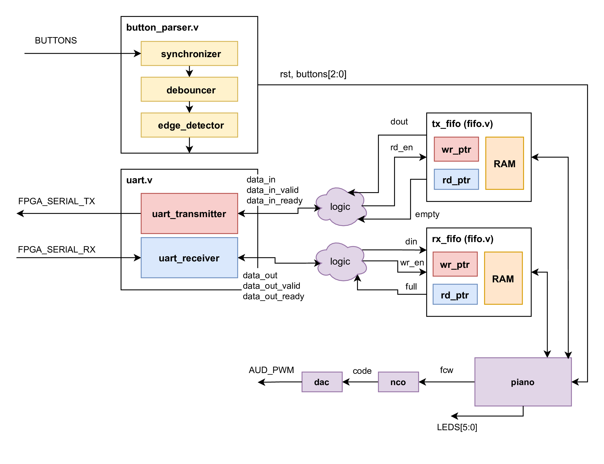
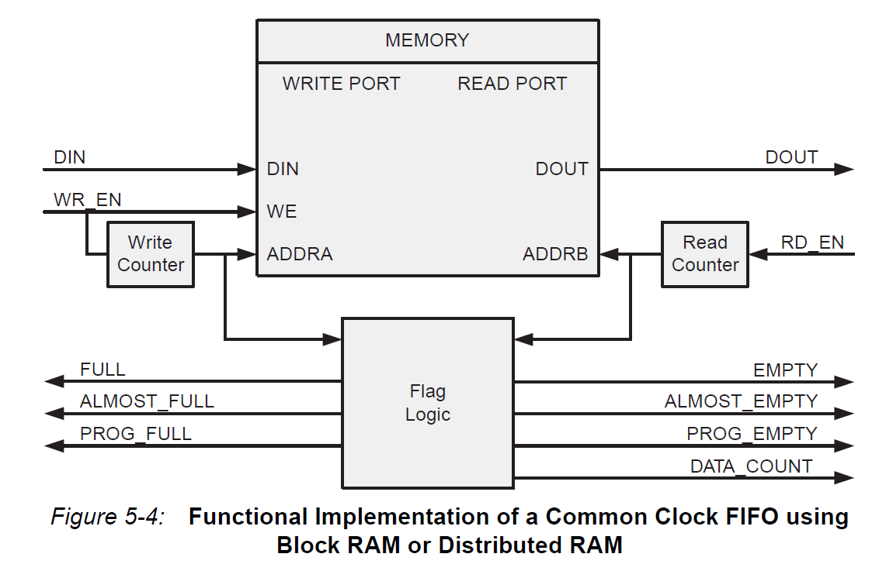
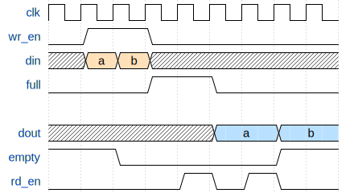

# FPGA Lab 6: FIFOs and UART Piano
<p align="center">
Prof. Sophia Shao
</p>
<p align="center">
TAs: Yikuan Chen, Alisha Menon, Seah Kim
</p>
<p align="center">
Department of Electrical Engineering and Computer Science
</p>
<p align="center">
College of Engineering, University of California, Berkeley
</p>

## Before You Begin
### Fetch Latest Lab Skeleton
```shell
cd fpga_labs_sp22
git pull origin master
```

### Copy Sources From Previous Lab
```shell
cd fpga_labs_sp22
cp lab5/src/synchronizer.v lab6/src/.
cp lab5/src/edge_detector.v lab6/src/.
cp lab5/src/debouncer.v lab6/src/.
cp lab5/src/uart_transmitter.v lab6/src/.
cp lab4/src/nco.v lab6/src/.
cp lab4/src/dac.v lab6/src/.
```

## Overview
In this lab we will:

- Design a first-in-first-out (FIFO) circuit
- Connect the FIFO and UART circuits together, bridging two ready-valid interfaces
- Implement an FSM to play notes via the NCO/DAC from keyboard input from the workstation

Here is an overview of the entire system in `z1top` we are going to build.
You may find it useful to refer to this block diagram while doing this lab.

<p align=center>
  
</p>

## Building a Synchronous FIFO
A FIFO (first in, first out) data buffer is a circuit that allows data elements to be queued through a write interface, and read out sequentially by a read interface.
The FIFO we will build in this section will have both the read and write interfaces clocked by the same clock; this circuit is known as a synchronous FIFO.

### FIFO Functionality
A FIFO is implemented with a circular buffer (2D reg) and two pointers: a read pointer and a write pointer.
These pointers address the buffer inside the FIFO, and they indicate where the next read or write operation should be performed.
When the FIFO is reset, these pointers are set to the same value.

When a write to the FIFO is performed, the write pointer increments and the data provided to the FIFO is written to the buffer.
When a read from the FIFO is performed, the read pointer increments, and the data present at the read pointer's location is sent out of the FIFO.

A comparison between the values of the read and write pointers indicate whether the FIFO is full or empty.
You can choose to implement this logic as you please.
The `Electronics` section of the [FIFO Wikipedia article](https://en.wikipedia.org/wiki/FIFO_(computing_and_electronics)) will likely aid you in creating your FIFO.

Here is a block diagram of a FIFO similar to the one you should create, from page 103 of the [Xilinx FIFO IP Manual](https://www.xilinx.com/support/documentation/ip_documentation/fifo_generator_ug175.pdf).

<p align=center>
  
</p>

The interface of our FIFO will contain a *subset* of the signals enumerated in the diagram above.

### FIFO Interface
Look at the FIFO skeleton in `src/fifo.v`.

The FIFO is parameterized by:
  - `WIDTH` - The number of bits per entry in the FIFO
  - `DEPTH` - The number of entries in the FIFO.
  - `POINTER_WIDTH` - Calculated as the width of the read and write pointers.

The common FIFO signals are:
  - `clk` - Clock used for both read and write interfaces of the FIFO.
  - `rst` - Reset (synchronous with `clk`); should force the FIFO to become empty.

The FIFO write interface consists of:
  - `input wr_en` - When this signal is high, on the rising edge of the clock, the data on `din` should be written to the FIFO.
  - `input [WIDTH-1:0] din` - The data to be written to the FIFO.
  - `output full` - When this signal is high, the FIFO is full.

The FIFO read interface consists of:
  - `input rd_en` - When this signal is high, on the rising edge of the clock, the FIFO should output the data indexed by the read pointer on `dout`.
  - `output [WIDTH-1:0] dout` - The data that was read from the FIFO after the rising edge on which `rd_en` was asserted.
  - `output empty` - When this signal is high, the FIFO is empty.

### FIFO Timing
The FIFO that you design should conform to the specs above.
Here is a timing diagram for a *2-entry* FIFO.
Note that the data on `dout` only changes *after the rising edge* when `rd_en` is high.

<p align=center>
  
</p>

<!--
https://wavedrom.com/editor.html
{signal: [
  {name: 'clk', wave: 'p........'},
  {name: 'wr_en', wave: '01.0.....'},
  {name: 'din', wave: 'x44x.....', data: ['a', 'b']},
  {name: 'full', wave: '0..1.0...'},
  {},
  {name: 'dout', wave: 'xxxxx5.5.', data: ['a', 'b']},
  {name: 'empty', wave: '1.0....1.'},
  {name: 'rd_en', wave: '0...1010.'}
]}
-->

### FIFO Testing
We have provided a testbench in `sim/fifo_tb.v`.

The testbench performs the following test sequence:
- Checks initial conditions after reset (FIFO not full and is empty)
- Generates random data which will be used for testing
- Pushes the data into the FIFO, and checks at every step that the FIFO is no longer empty
- When the last piece of data has been pushed into the FIFO, it checks that the FIFO is not empty and is full
- Verifies that cycling the clock and trying to overflow the FIFO doesn't cause any corruption of data or corruption of the full and empty flags
- Reads the data from the FIFO, and checks at every step that the FIFO is no longer full
- When the last piece of data has been read from the FIFO, it checks that the FIFO is not full and is empty
- Verifies that cycling the clock and trying to underflow the FIFO doesn't cause any corruption of data or corruption of the full and empty flags
- Checks that the data read from the FIFO matches the data that was originally written to the FIFO
- Prints out test debug info

This testbench tests one particular way of interfacing with the FIFO.
Of course, it is not comprehensive, and there are conditions and access patterns it does not test.
We recommend adding some more tests to this testbench (or writing a new testbench) to verify your FIFO performs as expected.
Here are a few tests to try:
  - Several times in a row, write to, then read from the FIFO with no clock cycle delays.
      This will test the FIFO in a way that it's likely to be used when buffering user I/O.
  - Try writing and reading from the FIFO on the same cycle.
      This will require you to use fork/join to run two threads in parallel.
      Make sure that no data gets corrupted.

## Building a Fixed Note Length Piano
The piano interfaces the UART with the NCO + DAC.
Its job is to fetch notes sent from the UART, convert them to a `fcw`, and send them to the `nco` (and `dac`) for a **fixed amount of time**.

**Implement `src/fixed_length_piano.v`**.
It has access to the UART transmitter FIFO, the UART receiver FIFO, and the `nco` inputs.
It also has access to a reset signal and the other buttons.

The piano should implement the following functionality:
- When the UART receiver FIFO contains a character, the FSM should pull the character from the FIFO and echo it back without modification through the UART transmitter FIFO.
- Once a character is pulled, its corresponding `fcw` should be read from the supplied `piano_scale_rom.v`.
- For a fixed amount of time (`note_length`), the note should be played by sending it to the `nco`. When a note isn't being played, the `fcw` should be set to 0
    - The `note_length` should default to 1/5th of a second, and can be changed by a fixed amount with the buttons.
    - `buttons[0]` increases the `note_length` and `buttons[1]` decreases the `note_length`
- Through doing all of this, your FSM should take care to ensure that if a FIFO is full, that it waits until it isn't full before pushing through data.
- You can use the `leds` output for debugging

You don't need to design the `fixed_length_piano` as an explicit FSM with states; the design is entirely up to you.

A ROM containing mappings from ASCII character codes to the `fcw` of the note to be played can be found in `src/piano_scale_rom.v`.

If you wish to re-generate this file, use these commands:

```bash
cd lab6
../scripts/piano_scale_generator scale.txt
../scripts/rom_generator scale.txt src/piano_scale_rom.v 256 24
# Modify piano_scale_rom.v to change the module name to 'piano_scale_rom'
```

It is possible that the UART receiver FIFO can fill up with samples so fast that the piano can't keep up; similar overflow conditions are possible with other parts of this system.
You don't need to concern yourself with detecting 'backpressure' on the entire system and can just assume that your FIFOs are large enough to buffer all the user input.

### Modify z1top
**Open up `z1top.v` and modify it** to include the new modules you wrote.
Wire up the FIFOs and your `fixed_length_piano` + `nco` + `dac` according to the block diagram in the lab intro.
You will have to add a few lines of logic (purple cloud) representing the bridge between the ready/valid interface and the FIFO's `rd_en, wr_en, full, empty` interface.

Make sure that you parameterize your FIFOs properly so that they have the proper `WIDTH` and `DEPTH`.
You can make your FIFOs as deep as you want, but 8 should be enough.

### Writing a System-Level Testbench
This design involves many moving parts that communicate with each other.
We want to make sure that the complete integration of our system works as expected.
To that end, you will have to write a system-level testbench that stimulates the top-level of your design and observes the top-level outputs to confirm correct behavior.

We have provided a template for a system testbench in `sim/system_tb.v`.
**Fill in** the `initial` block to test all the parts of the piano.

To make the waveform shorter and easier to debug, you can change the `CYCLES_PER_SECOND` parameter when instantiating `z1top` (and your `fixed_length_piano`) to something much shorter than 1/5th of a second.
You will want to check that the `fcw` being sent to the NCO is correct; you should use hierarchical paths and asserts to do this:
```verilog
assert(top.nco.fcw == 24'dxxxxx);
```

Note, you can get the integer corresponding to a ASCII character in Python (and vice versa):
```python
>>> ord('z')
122
>>> chr(122)
'z'
```

You will also want to check that the characters being sent to `z1top` are being echoed back correctly.
Use the `off_chip_uart`'s `data_out, data_out_valid, data_out_ready` interface to do this.

### FPGA Testing
Generate a bitstream and program the FPGA as usual.
Read the synthesis and implementation reports (`build/synth/synth.log`) to see if there are any unexpected warnings.

You should watch out specifically for warnings like `found x-bit latch` or `x signal unconnected` or `x signal assigned but never used`.
If you see that the synthesis tool inferred a latch, you should definitely fix that warning by completing any if-elseif-else or case statements that don't have a default signal assignment.
The other 2 warning types are dependent on your design and you should ignore them only if you know they are expected.

Once you put your design on the FPGA you can send data to the on-chip UART by using `screen $SERIALTTY 115200`.
The piano keys are mapped such that `z` through `<` go from C3 to C4 (middle C) and `q` through `i` go from C4 to C5.
Holding down shift moves the lower row's octave down and the upper row's octave up.

Use `buttons[0]` to reset the design.
Use `buttons[1]` and `buttons[2]` to change the `note_length` of your piano.

You should test the case where you make the `note_length` long, and fill up your UART FIFO by typing really fast.
Then watch your FIFO drain slowly as each note is played for `note_length` time.

## Extra Credit: Variable Note Length Piano
**The variable note length piano is for extra credit; it is optional.**

We would like to set the length of each note based on how long each key is pressed, instead of having a fixed note length.
We have provided a Python script that captures keyboard keyup/keydown events and translates them into 2 UART frames (a packet) indicating whether a note should begin playing or finish playing:

- A key press causes 2 UART frames to be sent in order: `{0x80, character}` where `character` is the key that was pressed
- A key release causes 2 UART frames to be sent in order: `{0x81, character}` where `character` is the key that was released

Once you get a key press packet, you should begin playing the note associated with `character`, similar to before.
If you get a key release packet that has a matching `character` with the note being played, you should stop playing it.

If you're playing a note and you get another key press packet, you should throw it away.
If you're playing a note and get a key release packet for a different `character`, you should throw it away.
*Note*: these scenarios aren't exercised by the `piano` script, but your hardware should still function if they happen.

You don't have to drive any characters into the UART TX in this part.
Drive an LED indicating when a note is being played.

**Implement** this functionality in `src/variable_length_piano.v`

### z1top Integration
We want to be able to switch between the fixed and variable length pianos using the same bitstream.
**Instantiate both types of pianos in `z1top`** and **use `switches_sync[1]` in `z1top` to select** which piano drives `fcw` and sees the FIFO inputs/outputs from the `rx_fifo` and `tx_fifo`.

When `SWITCHES[1]` is low, direct the FIFO inputs/outputs and `fcw` to the fixed length piano.

### Testing
**Modify the `system_tb`** (or create another one) to test variable length note playing, and test the edge cases where multiple keys are pressed before they are released.

Program it on the FPGA as usual.
Then run `../scripts/piano` which captures keyboard events and sends them to the FPGA via UART using the packetization described.
You can use the same keys as before.

The `piano` script works as follows:
- Once you press a key, it will be registered as the `active_key` and a key press packet will be sent to the FPGA.
- If you press another key while still holding down a previous key, the script will send a key release packet for the previous key and send a key press packet for the new key being pressed. The newly pressed key wll be registered as the `active_key`.
- If you release a key, and if the released key matches the `active_key`, a key release packet will be sent.

This logic allows you to rapidly press keys and have instant feedback from the piano.

## Lab Deliverables
### Lab Checkoff (due: right after the spring break)
To checkoff for this lab, have these things ready to show the TA:
  - Show the system-level testbench you wrote and its methodology for testing your piano's functionality
      - Show the output waveform of your testbench and explain how data moves through your system.
  - Demonstrate the fixed note length piano. Prove the existence of your UART RX and TX FIFOs by making the `note_length` long, pressing multiple keys in quick succession, filling the RX FIFO, and seeing the notes drain out slowly into the piano.
  - **Extra credit:** Demonstrate the variable note length piano working on the FPGA.

## Appendix
### Testing Locally (on your laptop)
First, install some python packages (`pip3 install pynput pyserial`).

If you're using Linux or OSX, you may have to launch the `piano` script with `sudo`.
On Ubuntu, you may have to run this line first if you [get an X11 error](https://stackoverflow.com/questions/48833451/no-protocol-specified-when-running-a-sudo-su-app-on-ubuntu-linux) (`xhost si:localuser:root`).

If you're on Windows, in addition to installing the Python packages, you should modify the `scripts/piano` file (line 10) with the COM port assigned to the USB-UART device (according to the Device Manager).


## Acknowledgement
This lab is the result of the work of many EECS151/251 GSIs over the years including:
- Sp12: James Parker, Daiwei Li, Shaoyi Cheng
- Sp13: Shaoyi Cheng, Vincent Lee
- Fa14: Simon Scott, Ian Juch
- Fa15: James Martin
- Fa16: Vighnesh Iyer
- Fa17: George Alexandrov, Vighnesh Iyer, Nathan Narevsky
- Sp18: Arya Reais-Parsi, Taehwan Kim
- Fa18: Ali Moin, George Alexandrov, Andy Zhou
- Sp19: Christopher Yarp, Arya Reais-Parsi
- Fa19: Vighnesh Iyer, Rebekah Zhao, Ryan Kaveh
- Sp20: Tan Nguyen
- Fa20: Charles Hong, Kareem Ahmad, Zhenghan Lin
- Sp21: Sean Huang, Tan Nguyen
- Fa21: Vighnesh Iyer, Charles Hong, Zhenghan Lin, Alisha Menon
- Sp22: Yikuan Chen, Alisha Menon, Seah Kim 
